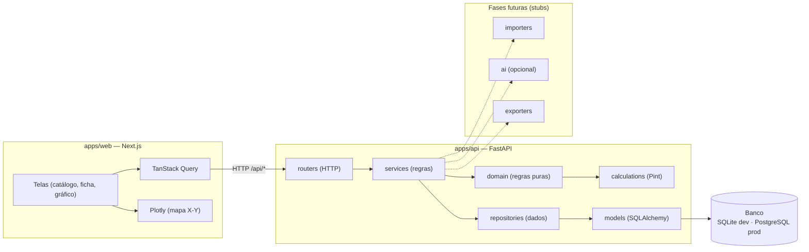

# Arquitetura

## Visão geral

Monorepo com dois aplicativos desacoplados e um pacote de contrato de tipos.

## Camadas do backend

O fluxo de uma requisição é estritamente unidirecional:

`routers` → `services` → `repositories` → `models` → banco.

- **routers** — apenas HTTP (validação de entrada, códigos de status). Sem regra
  de negócio.
- **services** — orquestram casos de uso e transformam entidades em schemas.
- **repositories** — única camada que consulta o banco, sempre com queries
  parametrizadas (SQLAlchemy), nunca SQL concatenado.
- **domain** — regras puras, sem I/O (ex.: política de dado ausente).
- **calculations** — cálculo determinístico (conversão de unidades via Pint).
- **models** — mapeamento objeto-relacional (SQLAlchemy 2.0).

Pastas `importers/`, `ai/`, `exporters/` existem como stubs documentados para as
fases futuras, tornando a arquitetura visível desde já sem código morto.

## Separação IA × cálculo

A camada de IA (futura) é opcional e desacoplada por trás de uma interface. Ela
**nunca** calcula valores nem altera resultados do backend — apenas interpreta o
problema, sugere propriedades/índices/gráficos e explica resultados já
calculados, sempre com confirmação do usuário. Ver
[`adr/0003-ia-desacoplada-do-calculo.md`](adr/0003-ia-desacoplada-do-calculo.md).

## Decisões

Registradas em [`adr/`](adr/): banco (SQLite agora, PostgreSQL depois), Pint para
unidades, e separação IA × cálculo determinístico.
