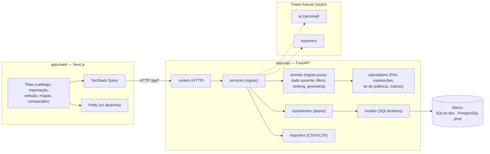

# Arquitetura

## Visão geral

Monorepo com dois aplicativos desacoplados e um pacote de contrato de tipos.

## Camadas do backend

O fluxo de uma requisição é estritamente unidirecional:

`routers` → `services` → `repositories` → `models` → banco.

- **routers** — apenas HTTP (validação de entrada, códigos de status). Sem regra
  de negócio.
- **services** — orquestram casos de uso e transformam entidades em schemas.
- **repositories** — única camada que consulta o banco, sempre com queries
  parametrizadas (SQLAlchemy), nunca SQL concatenado.
- **domain** — regras puras, sem I/O: política de dado ausente
  (`data_quality`), restrições (`filters`), ranking multicritério (`ranking`) e
  geometria dos envelopes (`geometry`).
- **calculations** — cálculo determinístico: unidades via Pint (`units`), parser
  seguro de expressões (`expressions`), avaliação de índices (`performance`) e
  análise de lei de potência para as linhas de índice (`powerlaw`).
- **models** — mapeamento objeto-relacional (SQLAlchemy 2.0).

`importers/` já está implementada (Fase 3). Pastas `ai/` e `exporters/` seguem
como stubs documentados das fases futuras, tornando a arquitetura visível desde
já sem código morto.

**Nada numérico é calculado na camada de apresentação.** Inclusive o que parece
puramente gráfico — inclinação de uma linha de índice, vértices de um envelope,
escores normalizados de um radar — vem pronto do backend, em unidades canônicas.
Ver [`adr/0004-geometria-de-graficos-no-backend.md`](adr/0004-geometria-de-graficos-no-backend.md).

## Separação IA × cálculo

A camada de IA (futura) é opcional e desacoplada por trás de uma interface. Ela
**nunca** calcula valores nem altera resultados do backend — apenas interpreta o
problema, sugere propriedades/índices/gráficos e explica resultados já
calculados, sempre com confirmação do usuário. Ver
[`adr/0003-ia-desacoplada-do-calculo.md`](adr/0003-ia-desacoplada-do-calculo.md).

## Decisões

Registradas em [`adr/`](adr/): banco (SQLite agora, PostgreSQL depois), Pint para
unidades, separação IA × cálculo determinístico, e geometria dos gráficos no
backend.
