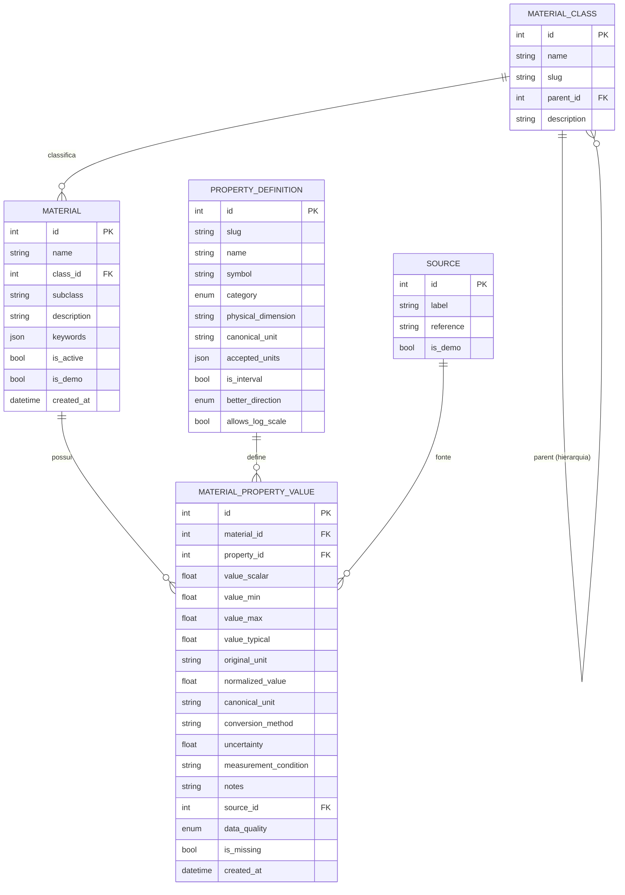

# Modelo de dados

Modelo relacional normalizado. Este documento descreve **as entidades do
catálogo**, que são a Fase 1 e a base de tudo o que veio depois.

> `PerformanceIndex`, `SelectionStudy`, `SelectionConstraint`, `RankingCriterion`,
> `ImportJob` e `ImportTemplate` foram implementadas nas Fases 3 e 4 e **não**
> estão no diagrama abaixo; elas estão em
> [`ARCHITECTURE.md`](ARCHITECTURE.md). `Project` continua sem existir — ver
> [`TODO.md`](TODO.md), onde ele é pré-requisito da autenticação.

## Diagrama entidade-relacionamento

## Notas de projeto

- **`MATERIAL_PROPERTY_VALUE`** é o núcleo da metodologia. Suporta valor escalar
  **ou** intervalo (`min`/`max`/`typical`) **ou** ausência explícita
  (`is_missing`), sempre preservando o rastro de unidade
  (`original_unit` → `normalized_value` em `canonical_unit`, com
  `conversion_method`).
- **Dado ausente:** `is_missing = true` com todos os campos numéricos `NULL`.
  Nunca `0`. Regra centralizada em `app/domain/data_quality.py`.
- **`SOURCE` como tabela** (e não campo texto): permite reuso da mesma referência
  por vários valores e futura formatação de citações (ABNT/APA) no relatório.
- **Condições de medição:** `measurement_condition` guarda o contexto (ex.:
  temperatura) de forma textual nesta fase; a arquitetura não impede evoluir para
  propriedades dependentes de condição (curvas) no futuro.
- **Taxonomia hierárquica:** `MATERIAL_CLASS.parent_id` referencia a própria
  tabela, permitindo classes e subclasses configuráveis (não hardcoded na UI).

## Migrations

O schema é versionado com Alembic (`apps/api/alembic/versions/`). A migration
inicial é gerada por autogenerate a partir dos models. Alembic é a fonte de
verdade; `create_all` é usado apenas por conveniência no seed e nos testes.
