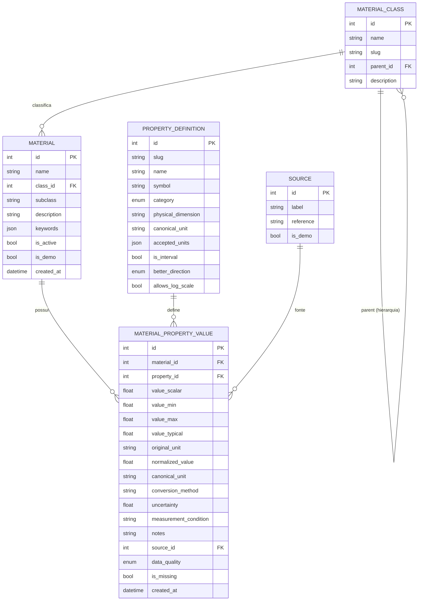

# Modelo de dados

Modelo relacional normalizado. Este documento descreve **as entidades do
catálogo**, que são a Fase 1 e a base de tudo o que veio depois.

> `PerformanceIndex`, `SelectionStudy`, `SelectionConstraint`, `RankingCriterion`,
> `ImportJob` e `ImportTemplate` foram implementadas nas Fases 3 e 4 e **não**
> estão no diagrama abaixo; elas estão em
> [`ARCHITECTURE.md`](ARCHITECTURE.md). `Project` continua sem existir — ver
> [`TODO.md`](TODO.md), onde ele é pré-requisito da autenticação.

## Diagrama entidade-relacionamento

```mermaid
erDiagram
  MATERIAL_CLASS ||--o{ MATERIAL : classifica
  MATERIAL_CLASS ||--o{ MATERIAL_CLASS : "parent (hierarquia)"
  MATERIAL ||--o{ MATERIAL_PROPERTY_VALUE : possui
  PROPERTY_DEFINITION ||--o{ MATERIAL_PROPERTY_VALUE : define
  SOURCE ||--o{ MATERIAL_PROPERTY_VALUE : fonte

  MATERIAL_CLASS {
    int id PK
    string name
    string slug
    int parent_id FK
    string description
  }
  PROPERTY_DEFINITION {
    int id PK
    string slug
    string name
    string symbol
    enum category
    string physical_dimension
    string canonical_unit
    json accepted_units
    bool is_interval
    enum better_direction
    bool allows_log_scale
  }
  SOURCE {
    int id PK
    string label
    string reference
    bool is_demo
  }
  MATERIAL {
    int id PK
    string name
    int class_id FK
    string subclass
    string description
    json keywords
    bool is_active
    bool is_demo
    datetime created_at
  }
  MATERIAL_PROPERTY_VALUE {
    int id PK
    int material_id FK
    int property_id FK
    float value_scalar
    float value_min
    float value_max
    float value_typical
    string original_unit
    float normalized_value
    string canonical_unit
    string conversion_method
    float uncertainty
    string measurement_condition
    string notes
    int source_id FK
    enum data_quality
    bool is_missing
    datetime created_at
  }
```

## Notas de projeto

- **`MATERIAL_PROPERTY_VALUE`** é o núcleo da metodologia. Suporta valor escalar
  **ou** intervalo (`min`/`max`/`typical`) **ou** ausência explícita
  (`is_missing`), sempre preservando o rastro de unidade
  (`original_unit` → `normalized_value` em `canonical_unit`, com
  `conversion_method`).
- **Dado ausente:** `is_missing = true` com todos os campos numéricos `NULL`.
  Nunca `0`. Regra centralizada em `app/domain/data_quality.py`.
- **`SOURCE` como tabela** (e não campo texto): permite reuso da mesma referência
  por vários valores e futura formatação de citações (ABNT/APA) no relatório.
- **Condições de medição:** `measurement_condition` guarda o contexto (ex.:
  temperatura) de forma textual nesta fase; a arquitetura não impede evoluir para
  propriedades dependentes de condição (curvas) no futuro.
- **Taxonomia hierárquica:** `MATERIAL_CLASS.parent_id` referencia a própria
  tabela, permitindo classes e subclasses configuráveis (não hardcoded na UI).

## Composição química e designações (D-105, TM2)

Duas tabelas que pendem de `MATERIAL` (e por isso herdam a visibilidade do
D-62), migração `0d3c39eb2f81`:

- **`MATERIAL_DESIGNATION`** — N por material: `system` (vocabulário fechado
  `DesignationSystem`: UNS, AISI/SAE, ASTM, EN, ISO, DIN, JIS, GB, ABNT, nome
  comercial), `code` como a fonte escreveu, `code_key` (NFKC, maiúsculas, sem
  espaços — só isso; pontuação fica), `region`, `source_id` **obrigatório**,
  `citation`, `is_demo`. Única por (material, sistema, `code_key`). Uma
  designação não declara equivalência com outro material (TM1).
- **`MATERIAL_COMPOSITION`** — uma linha por elemento (símbolo da lista fixa de
  118, `app/domain/elements.py`), em **% em massa**: `value_min`/`value_max`/
  `value_nominal` na `original_unit` (`%`, `wt%`, `ppm`, fração mássica) e
  `normalized_*` em `percent`, com `conversion_method`; `is_balance` (resto,
  **nunca calculado**) e `is_missing` (a fonte não deu valor), ambos sem número;
  `position` (ordem da fonte), `source_id` obrigatório, `citation`,
  `data_quality`, `is_demo`. `CHECK`s: elemento válido, resto/ausente sem
  número, linha numérica com ao menos um número, mín. ≤ máx., 0–100 %, nominal
  na faixa; único por (material, elemento) e um resto por material (índice
  parcial).

Sem linha de composição o material está "sem composição cadastrada" — não com
0 % de nada. A busca (`comp:`) lê a faixa por alcance em lógica de três
valores; ver D-105.

## Migrations

O schema é versionado com Alembic (`apps/api/alembic/versions/`). A migration
inicial é gerada por autogenerate a partir dos models. Alembic é a fonte de
verdade; `create_all` é usado apenas por conveniência no seed e nos testes.
