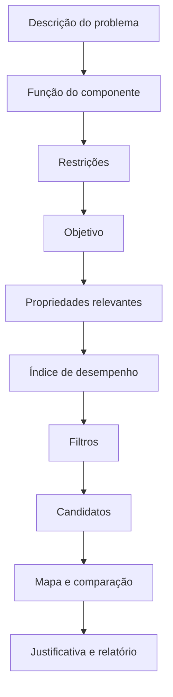

# Metodologia de seleção (Ashby)

Como a metodologia de Ashby é suportada pelo sistema. O detalhamento de cada
peça está em [`07-selecao-deterministica.md`](07-selecao-deterministica.md)
(filtros, índices, ranking) e [`08-visualizacao.md`](08-visualizacao.md) (mapas e
comparação).

## Conceitos

- **Mapa de propriedades:** gráfico com uma propriedade em cada eixo (ex.: módulo
  de Young × densidade), tipicamente em **escala logarítmica**, onde cada
  material é um ponto com seu intervalo, e cada classe um envelope. Disponível em
  `/mapas` e, de forma resumida, na ficha do material.
- **Índice de desempenho (M):** combinação de propriedades que traduz um objetivo
  de projeto sob uma restrição. Exemplos clássicos, todos semeados no catálogo:
  - rigidez específica: `E / ρ`;
  - resistência específica: `σ / ρ`;
  - viga leve limitada por rigidez: `E^(1/2) / ρ`;
  - placa leve limitada por rigidez: `E^(1/3) / ρ`.
- **Linha de índice:** reta no mapa log-log cuja inclinação corresponde ao
  índice; materiais do lado favorável são preferíveis. A inclinação é
  **derivada da expressão** pelo backend, não presumida — ver abaixo.

> Índices não são universais: cada um pressupõe uma **função**, **geometria**,
> **objetivo** e **restrição** específicos. O sistema exibe essas hipóteses
> junto de cada índice, com a dimensão do resultado (também derivada, via Pint) e
> a referência bibliográfica quando cadastrada.

## Fluxo de seleção

O assistente segue o método **Função → Restrições → Objetivo → Resultados**:

Toda recomendação é **revisável** pelo usuário e **reproduzível sem IA**: os
critérios ficam explícitos e o cálculo é determinístico no backend. Um estudo
salvo, reexecutado, produz exatamente o mesmo resultado.

## Índices e segurança de expressões

Índices personalizados passam por um **parser seguro** (sem `eval`), que aceita
apenas propriedades cadastradas, números, parênteses, operadores e potências
autorizados, com **validação dimensional** via `app/calculations/units.py`. A
dimensão do resultado é derivada percorrendo a mesma árvore com grandezas do
Pint, em vez de ser declarada à mão.

## Da expressão à reta

Para um índice `M = C · X^a · Y^b`, tomar o logaritmo dá
`log M = log C + a·log X + b·log Y`; ao longo de um contorno de `M` constante, a
inclinação no mapa log-log é `−a/b`. O sistema reescreve a expressão como
monômio (`app/calculations/powerlaw.py`) e obtém `a`, `b` e `C` — de onde saem a
inclinação e os extremos de cada reta de nível. Quando a expressão não é uma lei
de potência, ou depende de uma terceira propriedade, **não há reta** e o sistema
diz por quê, em vez de desenhar algo plausível.

## Ranking multicritério

**Soma ponderada normalizada**, com pesos, direção de otimização, método de
normalização (min-máx ou vetorial), contribuição por critério e análise de
sensibilidade. Dados ausentes são tratados explicitamente: o material é excluído
do ranking e reportado, nunca preenchido com zero ou média. A arquitetura
(critérios com direção/peso/normalização + matriz de escores) está preparada
para TOPSIS/AHP/PROMETHEE.
