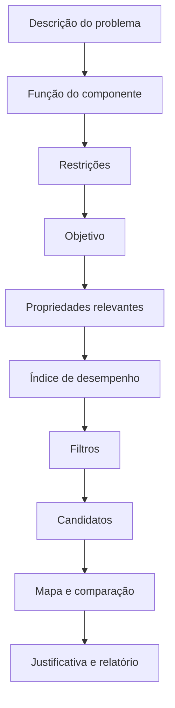

# Metodologia de seleção (Ashby)

Como a metodologia de Ashby é suportada pelo sistema. O detalhamento de cada
peça está em [`07-selecao-deterministica.md`](07-selecao-deterministica.md)
(filtros, índices, ranking) e [`08-visualizacao.md`](08-visualizacao.md) (mapas e
comparação).

## Conceitos

- **Mapa de propriedades:** gráfico com uma propriedade em cada eixo (ex.: módulo
  de Young × densidade), tipicamente em **escala logarítmica**, onde cada
  material é um ponto com seu intervalo, e cada classe um envelope. Disponível em
  `/mapas` e, de forma resumida, na ficha do material.
- **Índice de desempenho (M):** combinação de propriedades que traduz um objetivo
  de projeto sob uma restrição. Exemplos clássicos, todos semeados no catálogo:
  - rigidez específica: `E / ρ`;
  - resistência específica: `σ / ρ`;
  - viga leve limitada por rigidez: `E^(1/2) / ρ`;
  - placa leve limitada por rigidez: `E^(1/3) / ρ`.
- **Linha de índice:** reta no mapa log-log cuja inclinação corresponde ao
  índice; materiais do lado favorável são preferíveis. A inclinação é
  **derivada da expressão** pelo backend, não presumida — ver abaixo.

> Índices não são universais: cada um pressupõe uma **função**, **geometria**,
> **objetivo** e **restrição** específicos. O sistema exibe essas hipóteses
> junto de cada índice, com a dimensão do resultado (também derivada, via Pint) e
> a referência bibliográfica quando cadastrada.
>
> Onde: `apps/web/components/selection/IndexCard.tsx`, usado em `/selecao` e em
> `/mapas`. As hipóteses aparecem **antes** da escolha, dentro de cada cartão
> selecionável, e o conjunto completo — com a inclinação da reta quando há mapa —
> logo abaixo do grupo ([D-25](DECISIONS.md)). Uma expressão personalizada não
> tem hipóteses declaradas, e o cartão diz isso em vez de supor alguma.

## Fluxo de seleção

O assistente segue o método **Função → Restrições → Objetivo → Resultados**:

Toda recomendação é **revisável** pelo usuário e **reproduzível sem IA**: os
critérios ficam explícitos e o cálculo é determinístico no backend. Um estudo
salvo, reexecutado, produz exatamente o mesmo resultado.

## Índices e segurança de expressões

Índices personalizados passam por um **parser seguro** (sem `eval`), que aceita
apenas propriedades cadastradas, números, parênteses, operadores e potências
autorizados, com **validação dimensional** via `app/calculations/units.py`. A
dimensão do resultado é derivada percorrendo a mesma árvore com grandezas do
Pint, em vez de ser declarada à mão.

## Da expressão à reta

Para um índice `M = C · X^a · Y^b`, tomar o logaritmo dá
`log M = log C + a·log X + b·log Y`; ao longo de um contorno de `M` constante, a
inclinação no mapa log-log é `−a/b`. O sistema reescreve a expressão como
monômio (`app/calculations/powerlaw.py`) e obtém `a`, `b` e `C` — de onde saem a
inclinação e os extremos de cada reta de nível. Quando a expressão não é uma lei
de potência, ou depende de uma terceira propriedade, **não há reta** e o sistema
diz por quê, em vez de desenhar algo plausível.

## Ranking multicritério

**Soma ponderada normalizada**, com pesos, direção de otimização, método de
normalização (min-máx ou vetorial), contribuição por critério e análise de
sensibilidade. Dados ausentes são tratados explicitamente: o material é excluído
do ranking e reportado, nunca preenchido com zero ou média. Três métodos
adicionais reaproveitam essa mesma arquitetura de entrada (critérios com
direção/peso/normalização) sem remodelá-la: TOPSIS, PROMETHEE II e AHP para
derivar os pesos.

### TOPSIS

Ordena materiais pela proximidade a uma solução ideal: constrói um ponto
"melhor" e um ponto "pior" no espaço de critérios normalizado e ponderado (um
por critério, tomando o extremo favorável e o desfavorável conforme a
direção), e o escore de cada material é a razão entre sua distância ao pior e
a soma das distâncias ao melhor e ao pior — mais perto do ideal e mais longe
do anti-ideal, mais alto o escore. Herda sem alteração a exclusão de dado
ausente e a renormalização de pesos da soma ponderada. Decisão de escopo:
diferente da soma ponderada, a contribuição por critério **não soma** o
escore final — isso é específico da agregação linear da soma ponderada e não
tem equivalente em TOPSIS, cujo escore vem de uma razão de distâncias, não de
uma soma; a contribuição continua reportada por critério, só que como
transparência do cálculo, não como decomposição exata do escore.

### PROMETHEE II

Ordena por fluxo de saída líquido: compara cada material com todos os outros,
par a par, em cada critério, e agrega a margem de preferência média
ponderada pelos pesos dos critérios. Herda sem alteração a exclusão de dado
ausente e a renormalização de pesos da soma ponderada; exige ao menos dois
materiais com todos os critérios preenchidos, porque a comparação pareada não
tem o que fazer com um único candidato. Decisão de escopo: usa apenas a
função de preferência "usual" (tipo I de Saaty/Brans) — um material é
estritamente preferido a outro num critério, ou não é, sem limiares de
indiferença/preferência. A generalidade completa do PROMETHEE admite seis
formas de função de preferência com limiares ajustáveis por critério; a
"usual" não pede nenhum parâmetro além de direção e peso, a mesma informação
que a soma ponderada e o TOPSIS já coletam. Limiar ajustável fica para
trabalho futuro.

### AHP (derivação de pesos)

O AHP não é um quarto método de ranking: é uma forma alternativa de obter os
**pesos** que qualquer um dos três métodos acima consome, a partir de uma
matriz de comparação pareada entre critérios na escala 1–9 de Saaty (quanto
mais importante um critério é que o outro). Decisão de escopo: os pesos saem
por **média normalizada das colunas** da matriz — a aproximação documentada
do próprio Saaty ao autovetor principal, exata quando a matriz é
perfeitamente consistente —, não por um solver numérico de autovalor; a
mesma escolha (fechado em vez de dependência pesada de álgebra linear) já
usada para o envelope elíptico de `app/domain/geometry.py`. Toda matriz passa
por um teste de consistência (razão de consistência de Saaty); acima de 0,1 o
sistema **recusa** os pesos — nunca devolve pesos parciais nem "aproximados"
de julgamentos autocontraditórios, a mesma regra de não inventar número
aplicada aqui à derivação de peso.
