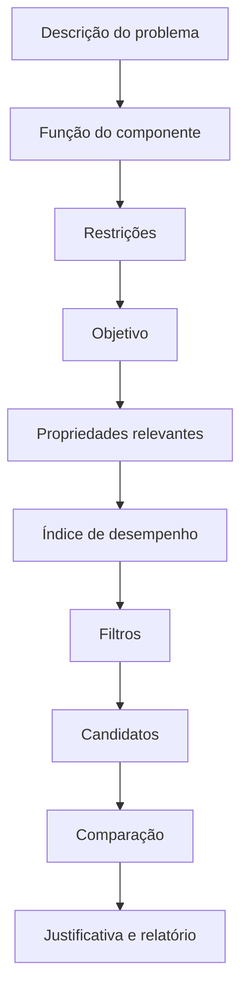

# Metodologia de seleção (Ashby) — roadmap

Este documento descreve como a metodologia de Ashby será suportada. A
implementação é incremental: a fatia atual entrega o **catálogo** e um **mapa de
propriedades** básico; índices, filtros e ranking vêm nas próximas fases
([`backlog.md`](backlog.md)).

## Conceitos

- **Mapa de propriedades:** gráfico com uma propriedade em cada eixo (ex.: módulo
  de Young × densidade), tipicamente em **escala logarítmica**, onde cada
  material é um ponto (ou envelope/intervalo). Já disponível na ficha do material
  (densidade × módulo de Young, com alternância linear/log).
- **Índice de desempenho (M):** combinação de propriedades que traduz um objetivo
  de projeto sob uma restrição. Exemplos clássicos:
  - rigidez específica: `E / ρ`;
  - resistência específica: `σ / ρ`;
  - viga leve limitada por rigidez: `E^(1/2) / ρ`;
  - placa leve limitada por rigidez: `E^(1/3) / ρ`.
- **Linha de índice:** reta no mapa log-log cuja inclinação corresponde ao índice;
  materiais acima da linha são preferíveis.

> Índices não são universais: cada um pressupõe uma **função**, **geometria**,
> **objetivo** e **restrição** específicos. O sistema exibirá essas hipóteses
> junto de cada índice, com as dimensões do resultado e a referência
> bibliográfica quando cadastrada.

## Fluxo de seleção (Fase 4)

O wizard seguirá o método **Função → Restrições → Objetivo → Variáveis livres**:

Toda recomendação será **revisável** pelo usuário e **reproduzível sem IA**: os
critérios ficam explícitos e o cálculo é determinístico no backend.

## Índices e segurança de expressões (Fase 4)

Os índices personalizados usarão um **parser seguro** (sem `eval`), aceitando
apenas propriedades cadastradas, números, parênteses, operadores e potências
autorizados, com **validação dimensional** sempre que possível (reaproveitando
`app/calculations/units.py`).

## Ranking multicritério (Fase 4)

Começará por **soma ponderada normalizada**, com pesos, direção de otimização,
método de normalização, contribuição por critério e análise de sensibilidade.
Dados ausentes serão tratados explicitamente (nunca preenchidos automaticamente
sem avisar). Arquitetura preparada para TOPSIS/AHP/PROMETHEE.
