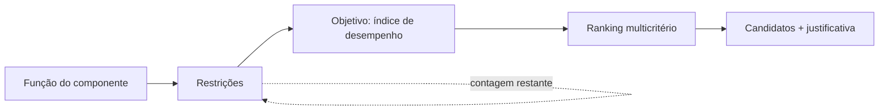

# Seleção determinística (Fase 4)

A seleção é o núcleo **reproduzível sem IA** do sistema. Todo o cálculo acontece
no backend, nas camadas puras `domain` e `calculations`, e qualquer análise pode
ser salva como um **estudo** e reaberta/reexecutada sem nenhuma dependência de
IA.

## Fluxo (método de Ashby)



Wizard: **Função → Objetivo → Restrições → Resultados** (ordem da tela, D-88; o
motor continua filtrando e só então ordenando). Os pesos dos critérios somam 1,
com orçamento e prévia do top 5 calculados em `POST /api/selection/weights-preview`
(D-87). A cada restrição, o funil de eliminação mostra quantos candidatos restam.

## Restrições (`app/domain/filters.py`)

Operadores: `>`, `≥`, `<`, `≤`, faixa (`between`), fora da faixa (`outside`),
existe / não existe, pertence / não pertence a classe, texto contém. Combináveis
por **AND** (funil cumulativo) ou **OR** (união).

- Os limiares são informados em qualquer unidade compatível e **convertidos uma
  única vez** para a unidade canônica (via Pint) antes da comparação; unidade
  incompatível é rejeitada (HTTP 400).
- Uma restrição numérica sobre uma propriedade **ausente** no material o
  **elimina** — não se seleciona sobre dado que não se tem. Os operadores
  `existe`/`não existe` permitem filtrar por completude de dados de propósito.

### Grupos aninhados (M6)

O AND/OR acima é, na verdade, um caso particular: cada restrição vive dentro de
um **grupo** (`ConstraintGroup`), e é o grupo — não o estudo — que carrega o
operador AND/OR. Um grupo combina, sob seu próprio operador, as restrições que
tem diretamente e o resultado recursivo de cada grupo-filho que aninhar dentro
dele (`app/domain/filters.py::ConstraintGroupNode`,
`apply_constraint_tree`). Isso permite parênteses lógicos de verdade — por
exemplo, `(rigidez > 100 OU densidade < 3) E classe = "metais"` é um grupo
raiz AND com duas restrições/subgrupos: um subgrupo OR com as duas restrições
de rigidez e densidade, e a restrição de classe diretamente no grupo raiz.

Um estudo salvo antes do M6 — ou um estudo novo que não use aninhamento — é
exatamente um grupo raiz sem filhos, com sua lista plana de restrições e um
único operador: a mesma árvore de um nó só, avaliando **identicamente** ao
`apply_constraints` de antes. A migration `6845a9523f17` faz esse backfill
para todo estudo pré-existente (um `ConstraintGroup` raiz por estudo, com o
`combinator` que ele já tinha), e a prova de equivalência comportamental para
o caso de um único grupo raiz está nos testes de `filters.py`.

> **Limitação do M6, resolvida no P0-1:** `StudyOut` devolvia as restrições de
> um estudo aninhado como lista plana, então reabrir o estudo mostrava tudo
> achatado num único grupo AND, sem aviso nenhum. Nunca foi perda de dado — a
> árvore real seguia intacta no banco e era o que o estudo *executava* —, mas
> era uma lacuna de round-trip. `StageOut.root_group` agora devolve a árvore
> inteira, e `fromConstraintPayload` a reconstrói no editor.

## Estágios (P0-1)

Os grupos acima descrevem **um** filtro. Um estudo, porém, é uma **pilha
ordenada de estágios** (`SelectionStage`), e o resultado é a interseção dos
estágios **habilitados**, na ordem em que estão ([D-56](DECISIONS.md)).

**O estudo escolhe o universo do resultado** (P0-3, [D-58](DECISIONS.md)):
`material` (o padrão, e todo estudo salvo antes disso) ou `process`. É coluna e
não inferência — uma pilha de um único estágio de limites não nomeia universo
nenhum. Os tipos de estágio disponíveis decorrem dele: um estudo de materiais
aceita `limit`/`tree`/`process`, um de processos aceita `limit`/`tree`/`material`.

`tree` sempre anda a taxonomia do **próprio** universo do estudo, e o estágio de
travessia é o que nomeia o outro. Por isso **qual taxonomia valida `class_slugs`
decorre do universo, não do nome do campo**, que é o mesmo nos dois.

Há **cinco** tipos, e um estágio é uma pergunta só — enviar os campos de outro
tipo é recusado, não ignorado:

- **`limit`** — uma árvore de restrições, exatamente a do M6 acima. O estágio é
  dono de um `ConstraintGroup` raiz; todo grupo aninhado carrega o mesmo
  `stage_id`.
- **`tree`** — uma seleção de pastas da taxonomia (`class_slugs`). Com
  `include_descendants` (o padrão), escolher uma classe traz tudo abaixo dela.
  Isso é o que a restrição `in_class` **não** faz: ela compara o slug da própria
  classe do material, e como todo material mora numa folha, marcar um galho ali
  não admite ninguém. As duas continuam existindo porque respondem a perguntas
  diferentes — "exatamente nesta classe" e "nesta família".
- **`process`** — a junção com o universo de processos (P0-2,
  [D-57](DECISIONS.md)): mantém os materiais que **algum** processo selecionado
  serve. Leva duas listas, porque são namespaces diferentes: `process_slugs`
  (folhas, os processos em si) e `process_class_slugs` (pastas, as famílias),
  com `include_descendants` valendo para as pastas.

  **Algum, não todos.** "Soldável **e** forjável" são dois estágios, e a pilha
  já os intersecta — expressar isso duas vezes criaria duas formas de dizer a
  mesma coisa. E **ausência não passa**: material sem processo vinculado não
  sobrevive a um estágio de processo, pela mesma regra da restrição numérica —
  não se seleciona sobre dado que não se tem. Processo inativo também não admite
  ninguém, mesmo com o vínculo ainda no banco.

- **`material`** — a mesma junção do outro lado (P0-3), num estudo de processos:
  mantém os processos que servem **algum** material das pastas escolhidas, em
  `material_class_slugs`. **Só pastas**: um `Material` não tem slug para nomear
  uma folha, e o exercício 11 do manual seleciona uma pasta.

- **`chart`** — uma **região de um plano** (P1-2, [D-60](DECISIONS.md)), e o
  único tipo que vale nos dois universos sem mudar de nome. Ver abaixo.

### Atributos de processo (P0-4)

Um estágio de limites num estudo de processos nomeia **atributos de processo**, e
não propriedades de material — a mesma regra que `tree` segue para pastas
([D-59](DECISIONS.md)). Os dois catálogos são tabelas separadas
(`process_attribute_definition`, `process_attribute_value`), com o trilho de
proveniência inteiro de `material_property_value`, e um slug de material num
estudo de processos é **404 nomeando o que não existe** — antes do P0-4 ele era
aceito, convertido, e o estágio então não admitia ninguém, sem explicação.

`ProcessAttributeKind` diz qual a forma do valor, e é o que decide como comparar:

- **`ESCALAR`** — um número, comparado exatamente como uma propriedade de
  material.
- **`ENVELOPE`** — uma **faixa de capacidade**, comparada por **alcance**: um
  processo que conforma peças de 0,1 a 10 kg atende "≥ 5 kg". Não é a regra do
  intervalo de material, e a diferença está no dado: lá a faixa é dispersão em
  torno de um valor verdadeiro e o ponto médio o representa; aqui todo ponto de
  dentro é de fato alcançável. `between` sobre envelope é **sobreposição**, não
  contenção. A regra aparece no rótulo da restrição ("alcance do envelope"), na
  coluna *Tipo de valor* da folha de proveniência e na nota dela.
- **`DISCRETO`** — rótulos de um vocabulário fechado (`allowed_labels`),
  respondidos por pertinência: `has_any_label` / `has_no_label`. O operador
  negativo **não** libera ausência — processo sem `forma` cadastrada não é "um
  processo cuja forma não é maciça" —, e rótulo fora do vocabulário é 404
  nomeando o rótulo, nunca zero resultado.

**Ranqueamento e índice passaram a valer num estudo de processos**, e a recusa de
D-58 foi retirada em vez de reescrita. O que se recusa agora é atributo
inexistente e atributo **discreto** onde se exige magnitude: como critério de
ranqueamento (um rótulo não é melhor que outro, então não há ordem) e dentro de
expressão de índice (pelo nome, não pelo erro de dimensão que a unidade NULL
produziria depois). Um envelope é ranqueado pelo **ponto representativo** — o
mesmo `normalized_value` de sempre — enquanto continua sendo filtrado pelos
limites.


### O estágio de gráfico (P1-2)

O gráfico deixa de só mostrar e passa a **reprovar** ([D-60](DECISIONS.md)). Um
estágio `chart` carrega o plano e o que foi desenhado nele — a **caixa** (um
limite por eixo) e a **linha iso-índice** (que admite o lado favorável) —, e
qualquer um dos dois pode faltar.

**Nada disso é geometria, e a linha é o caso que parece ser.** O lado favorável de
um contorno iso-índice é exatamente `índice ≥ nível` quando se maximiza, e `≤`
quando se minimiza — é o mesmo conjunto que `ChartService._draw_levels` já computa
para *desenhar* a linha. Manter a regra como comparação é o que faz a figura e o
funil concordarem por construção.

**O que este estágio acrescenta ao de limites é um só, e é real:** um estágio de
limites nomeia **slug de propriedade**, então não alcança quantidade derivada.
"Todo material cujo E^(1/2)/ρ bate este" não são quatro limiares sobre duas
propriedades — é um limiar sobre uma combinação delas. Cada eixo é, então, *ou*
uma propriedade cadastrada *ou* uma expressão de índice; nunca as duas e nunca
nenhuma, garantido por `CheckConstraint`.

**Registro que não pode ser posto no plano nunca passa** — mesmo onde a caixa não
limita aquele eixo, e mesmo sem caixa nenhuma. Não é a regra que um limiar daria
(um limiar só rejeita o que consegue comparar), e a diferença é deliberada: o
critério é "dentro desta região deste plano", e registro sem coordenada não é
desenhado no plano. Isso torna um estágio sem caixa e sem linha uma coisa com
sentido — "tem de ser plotável aqui".

**Um envelope (P0-4) entra pelo ponto representativo**, porque é o único ponto
que o mapa desenha, enquanto um estágio de limites compara o mesmo atributo por
**alcance**. Duas regras para o mesmo dado, e é por isso que o documento diz qual
rodou — a obrigação que o [D-59](DECISIONS.md) assumiu.

Os limites da caixa são **coordenadas de dados em unidade canônica**, nunca
pixels (ADR 0004), e não há campo de unidade: os números são lidos de um eixo que
o `ChartService` já desenha assim. NULL é "sem limite" e `0` é um limite, então
uma caixa aberta de um lado é coisa que se desenha e o lado aberto continua
distinguível de um zero — do banco até a legenda da figura. O nível da linha é um
**número** e não "a linha que passa pelo material 7": guardar o registro moveria a
linha toda vez que o dado dele mudasse, e um estudo salvo tem de reexecutar para a
mesma resposta.

A expressão é avaliada pelo **serviço**, uma vez por execução, e o resultado vai
para `RecordSnapshot.derived` — mapa separado de `values` porque a proveniência é
outra, e arquivado sob o texto da própria expressão. O domínio compara números e
nunca avalia expressão, exatamente como um limiar chega até ele já convertido.

A migration `f2b6d0e39c47` acrescenta as onze colunas do payload, todas anuláveis
e **sem backfill** — a informação é nova, e nenhum estágio já salvo é de gráfico.


`enabled` é coluna e não exclusão: desligar e religar um estágio é *como* se vê
o efeito de um critério. Um estágio desligado não estreita, mas continua no
relatório e ainda diz **quantos admitiria sozinho** — a pergunta que desligar
faz.

A migration `a1c4f2e8b7d3` dá a cada estudo pré-existente exatamente um estágio
`limit` habilitado na posição 0, dono do grupo raiz que o M6 já lhe dera. Com um
estágio, o funil plano sai **idêntico** ao de antes: sem prefixo, sem linha
extra. Com mais de um, cada linha nomeia seu estágio.

A migration `b7e2d9c4a105` acrescenta `process_slugs` e `process_class_slugs`
do mesmo jeito aditivo: nullable, backfill com `[]`, então NOT NULL. Um estágio
salvo antes do P0-2 continua sendo exatamente o que era.

Pilha vazia não existe em lugar nenhum: nem no banco, nem na API (`stages: []`
é 400), nem na tela (o último estágio não pode ser removido). Um estudo cujas
linhas descrevem estágio nenhum degrada para um estágio sobre a árvore inteira,
em vez de admitir o catálogo todo em silêncio.

O funil nomeia **qual** pergunta cada estágio de pergunta única fez:
`in_tree` para o de árvore, `in_process` para o de processos, `in_material`
para o de materiais e `in_chart` para o de gráfico. Chamar os quatro da mesma
coisa diria ao leitor que a seleção filtrou por algo que ela não filtrou.

## Índices de desempenho (`app/calculations/expressions.py`)

Um índice é uma expressão sobre os slugs das propriedades (ex.:
`modulo_young / densidade`). O avaliador é **seguro, sem `eval`**:

1. a expressão é convertida em AST (`ast.parse`);
2. um whitelist recursivo aceita apenas números, variáveis, `+ - * / **`, unário
   `+/-`, parênteses e as funções `sqrt`, `cbrt`, `abs` — qualquer outro nó
   (atributos, índices, chamadas, lambdas, comprehensions, strings) é rejeitado;
3. um interpretador manual percorre a árvore.

O **mesmo interpretador** roda em dois domínios numéricos: `float` (valor do
índice por material) e `Quantity` do Pint (análise dimensional — a dimensão do
índice é **derivada**, não presumida). Somar termos dimensionalmente
incompatíveis ou elevar uma grandeza a um expoente com dimensão é rejeitado.

Índices semeados (clássicos de Ashby): rigidez específica `E/ρ`, resistência
específica `σ/ρ`, viga leve por rigidez `E^(1/2)/ρ`, viga leve por resistência
`σy^(2/3)/ρ`, placa leve `E^(1/3)/ρ`, componente leve `σy/ρ` — cada um com
função, geometria, objetivo, restrição e referência.

## Casos de carga: o Solver e o Index Finder (`app/calculations/load_cases.py`)

Um índice ordena materiais; ele não diz quanto a peça pesa. O que fecha essa
distância é o **caso de carga** — e o mesmo objeto responde às duas perguntas do
método ([D-64](DECISIONS.md)):

- lido por **faceta** (função, restrição, objetivo, variável livre), é o
  *Performance Index Finder*: qual índice esta combinação produz;
- preenchido com **números**, é o *Engineering Solver*: quantos quilos dá — ou
  quanto custa em material, se o objetivo escolhido for o custo
  ([D-65](DECISIONS.md)).

A derivação de Ashby separa o objetivo em fatores:

```
m = (fator estrutural) × (agrupamento material)
```

e o agrupamento material **é** o índice, invertido. Daí a regra de que o solver
depende, verdadeira por construção em todos os sete casos:

```
massa = fator estrutural / índice
```

Cada caso guarda **só a metade estrutural**; o índice é lido do catálogo pelo
slug na hora de resolver. Duas cópias de uma fórmula viram duas respostas.

**Os dois espaços de nomes não se misturam.** Expressão estrutural só nomeia
variável de projeto (`comprimento`, `rigidez`, `carga`, `momento`, `largura` e as
duas constantes de apoio); índice só nomeia slug de propriedade. `_validate`
recusa isso **no import** do módulo.

Os sete casos, com a variável que cada um libera:

| Caso | Restrição | Variável livre | Índice |
|---|---|---|---|
| Tirante em tração | Rigidez axial S | Área A | `E/ρ` |
| Tirante em tração | Carga F sem romper | Área A | `σu/ρ` |
| Componente axial | Carga F sem escoar | Área A | `σy/ρ` |
| Viga em flexão | Rigidez à flexão S | Área A | `E^(1/2)/ρ` |
| Viga em flexão | Momento M sem escoar | Área A | `σy^(2/3)/ρ` |
| Placa em flexão | Rigidez à flexão S | **Espessura t** | `E^(1/3)/ρ` |
| Coluna em compressão | Carga crítica de Euler | Área A | `E^(1/2)/ρ` |

**Cada caso nomeia um segundo índice: o gêmeo de custo** ([D-65](DECISIONS.md)).
Trocar ρ por ρ·Cm no agrupamento material faz a mesma derivação minimizar o
**custo de material da peça**; o fator estrutural não muda em nada, e é por isso
que um caso nomeia dois slugs em vez de carregar duas derivações. Os gêmeos são
os seis índices acima com `· Cm` no denominador (`E/ρCm`, `σu/ρCm`, `σy/ρCm`,
`E^(1/2)/ρCm`, `σy^(2/3)/ρCm`, `E^(1/3)/ρCm`), e quem chama a API nomeia o
**objetivo**, nunca o índice: `LoadCase.index_slug_for` escolhe.

A consequência que precisa chegar ao leitor: `custo_massa` é **adimensional** de
propósito (dinheiro não está em sistema de unidades nenhum), então `fator
estrutural / índice de custo` sai com **a mesma dimensão da massa**. A prova
dimensional continua derrubando um expoente errado num gêmeo — o que ela deixou
de fazer é dizer o que o número é. Daí o objetivo, a unidade ("unidade monetária
não especificada") e a razão disso virem escritos na resposta.

Viga em flexão e coluna em flambagem caem no **mesmo** índice, e não por
coincidência: nos dois a restrição é elástica e a seção entra ao quadrado.

A **condição de apoio** (constante C da flecha, fator de extremidade n² de Euler)
é escolha nomeada que preenche uma variável de projeto, nunca constante
escondida: é ela que faz dois briefings idênticos darem respostas diferentes.

A unidade de cada resposta é **derivada** pelo Pint a partir das unidades
canônicas, e há teste por caso exigindo que o fator estrutural dividido pelo
índice saia na unidade que o caso declara — mais um teste que recalcula a massa
direto da equação de restrição. Um expoente errado numa derivação nova derruba os
dois.

Material sem alguma propriedade que o caso exige sai em `excluded` **com os slugs
que lhe faltam** (princípio 3), no mesmo contrato de `ranking.ExcludedMaterial`.

Fora de v1, e nomeado: seções além de maciça quadrada e retangular, e caso de
carga cadastrado pelo usuário — uma derivação se verifica por revisão, como
`units.py`, não por digitação. (O objetivo **custo** estava nesta lista até o P3;
saiu com o Part Cost Estimator, que era do que ele dependia.)

Casos-limite tratados: divisão por zero, resultado não finito, base negativa com
expoente fracionário (resultado complexo), overflow, variável sem valor →
o índice fica **indefinido** para aquele material (nunca um número inventado).

## Custo da peça (`app/calculations/part_cost.py`)

O caso de carga responde "que material faz esta peça mais leve — ou mais barata
em material". A pergunta irmã é **quanto custa fazê-la**, processo a processo, e
é o que este módulo estima ([D-65](DECISIONS.md)):

```
C = m·Cm/(1−f) + C_t/n + Ċ_oh/ṅ + C_c/(ṅ·t_wo·L)
```

- `m·Cm/(1−f)` — **material**, já contando a fração de refugo `f`;
- `C_t/n` — **ferramental** dedicado, diluído pelo lote `n`;
- `Ċ_oh/ṅ` — **overhead** da oficina, por peça, à taxa de produção `ṅ`;
- `C_c/(ṅ·t_wo·L)` — **capital** do equipamento, amortizado em `t_wo` anos com
  fator de carga `L`.

**O estimador devolve os termos, nunca só o total.** Cada um anda com o lote de
um jeito: o material é um **piso** que lote nenhum atravessa, o ferramental cai
com 1/n e é o único que cai, e os dois termos de tempo não se mexem com `n`. É o
cruzamento entre dois processos conforme `n` cresce que decide alguma coisa; um
total sozinho seria oráculo.

**Premissa de oficina é entrada com valor visível.** Horizonte de amortização e
fator de carga não são fatos de processo nenhum — duas fábricas com a mesma
prensa amortizam em prazos diferentes —, então vão como campo com padrão
sobrescrevível, do mesmo jeito que a condição de apoio do caso de carga. As
8760 h/ano ficam separadas do fator de carga: uma é calendário, o outro é
escolha.

**Dinheiro não está em sistema de unidades nenhum.** `custo_massa` é catalogado
como adimensional de propósito, e toda resposta monetária sai em "unidade
monetária não especificada". Imprimir um símbolo de moeda que o catálogo nunca
registrou seria inventar dado — o princípio 1 de outro chapéu.

Processo sem um dos cinco atributos econômicos que o modelo exige sai em
`uncosted` **com os slugs e os rótulos que lhe faltam** (princípio 3): um
ferramental em branco faria o processo mais capital-intensivo parecer o mais
barato.

## Auditoria ambiental (`app/calculations/eco_audit.py`)

O estimador de custo responde quanto custa fazer a peça em dinheiro. Esta
responde em **energia e carbono**, sobre cinco fases — material, manufatura,
transporte, uso e fim de vida ([D-66](DECISIONS.md)). E a resposta **não é o
total**: é qual fase domina, porque é nela que esforço de projeto muda alguma
coisa. Uma porta de carro se decide na fase de uso; uma sacola plástica, na de
material.

**A fase de uso tem dois modelos, e eles não são variantes de um:**

| Modelo | Conta | A massa da peça |
|---|---|---|
| `estatico` | potência × horas em serviço | **não entra** |
| `movel` | massa × distância percorrida × intensidade | fator linear |

Escolher errado inverte a auditoria: aliviar a peça economiza muito num modelo e
*exatamente nada* no outro. Por isso o modelo é escolha declarada que carrega os
próprios campos, e **os campos do outro modelo são recusados, nunca ignorados** —
um número que o leitor digitou e a soma não contém é pior do que um erro.

**A fase de material é cobrada sobre a massa comprada**, `massa / (1 − f)`, a
mesma fatoração do termo de material do custo (D-65). Daí a auditoria exigir um
processo: auditar uma peça é auditar *fazer* a peça. A consequência boa é que um
processo perdulário aumenta **também** a fase de material, não só a de manufatura.

**A reciclagem aparece duas vezes e nunca se cancela:** energia gasta no fim
desta vida, energia poupada no início da próxima (pelo teor reciclado de quem
comprar o material). Abater crédito é escolha de método que normas diferentes
fazem diferente, e este módulo não a faz.

**Auditoria incompleta não se resume, só se lista.** Faltando o dado de qualquer
fase, a fase dominante é recusada com o motivo escrito — a fase que ninguém
calculou pode ser justamente a que domina — e o total também. Aterro e
incineração não têm energia catalogada nesta versão e **não viram zero**: um
aterro grátis faria enterrar a peça parecer a coisa mais barata que se pode fazer
com ela.

Energia e carbono têm **pódios independentes**, porque leem dados diferentes e
podem discordar — com rede elétrica limpa, a fase que domina em energia não é a
que domina em carbono. A energia é derivada pelo Pint em MJ; o carbono é dito em
palavras ("kg de CO₂"), porque uma razão entre massas de substâncias diferentes
o Pint reduz a adimensional, como faz com dinheiro.

## Síntese de registros derivados (`app/calculations/synthesis.py`)

Este módulo cria **materiais hipotéticos**: um compósito de dois constituintes
com fração volumétrica declarada, ou uma espuma de um sólido com densidade
relativa declarada ([D-67](DECISIONS.md)). É o cálculo que mais perto passa de
violar o princípio 1, e a distinção que o separa é uma só: **um valor sintetizado
não é inventado; é calculado, e a diferença é que ele carrega a derivação.** O
registro é declarado sintetizado com a receita gravada, cada valor nomeia a lei
que o produziu, e a qualidade do dado é a **pior dos pais que a regra leu** —
incerteza de entrada propagada; incerteza de modelo dita em palavras, nunca
convertida em barra de erro.

**A regra de mistura é propriedade da propriedade, não da receita**, e é isso que
impede a ferramenta de mentir com aritmética correta:

| Propriedade | Regra num compósito | Base |
|---|---|---|
| Densidade | linear **por volume** (conservação de massa) | exata |
| Módulo, condutividade | **par de limites** de Voigt e Reuss | limites |
| Custo e grandezas ambientais | linear **por fração mássica** | exata |
| Temperatura máxima de serviço | o **mínimo** dos dois | exata |
| Resistência | **não tem regra** | — |

As três primeiras linhas se distinguem no dado, não na fórmula: uma grandeza *por
unidade de massa* mistura por fração mássica, o que exige as **duas** densidades,
e usar a fração volumétrica ali é invisível até os constituintes terem densidades
diferentes. Num módulo, Voigt vale ao longo das fibras e Reuss transversalmente —
como a direção não está catalogada, a média entre eles seria um número só onde a
resposta honesta são dois.

**A última linha é o achado.** Resistência de compósito é controlada pela
interface entre fibra e matriz, e a interface é exatamente aquilo sobre o que o
catálogo não sabe nada. Numa **espuma**, ao contrário, o mecanismo de falha é
entendido e escala (Gibson–Ashby), então ela *tem* regra de resistência — uma
espuma é o mesmo material com vazios, um compósito são dois materiais com uma
interface entre eles. A diferença não está na fórmula; está no que se sabe.

Propriedade sem regra declarada **não é sintetizada**: o registro derivado
simplesmente não a tem, com o motivo escrito (princípio 3). Uma propriedade que
aparecesse ao mesmo tempo na tabela de regras e na de ausências é recusada **no
import** por `_validate()`, como nos casos de carga do D-64. E um registro
sintetizado é sempre **próprio**, nunca do catálogo compartilhado — `CheckConstraint`
no banco, não só regra de serviço.

### Painel sanduíche: o arranjo, e não a mistura

O terceiro tipo de síntese é o que mostra os limites do parágrafo acima
([D-68](DECISIONS.md)). Duas faces de espessura **t** sobre um núcleo de
espessura **c**, e o resultado se divide em duas metades que não se parecem:

**Densidade e grandezas por massa são as regras do compósito, sem adaptação.**
Num painel de área constante a fração de espessura *é* a fração de volume, então
`ρ*` sai pela regra das misturas por volume com `f = 2t/d`, e custo e as
grandezas ambientais por fração mássica, como sempre. Massa é massa: o arranjo
não a move. É a mesma `Rule` do compósito, não um valor que coincide.

**O módulo é outra coisa.** `E*` é o módulo de flexão equivalente — o que uma
placa homogênea de mesma espessura precisaria ter para ser tão rígida quanto
este painel:

```
E* = 12 · [ Ef·t³/6 + Ef·t·(c+t)²/2 + Ec·c³/12 ] / (c + 2t)³
```

Os três termos são as faces em torno dos próprios eixos, as faces em torno do
eixo do painel (o dominante) e o núcleo. **Ele passa do limite de Voigt**, e é
esse o fato que prova que não se trata de mistura: com uma face de 70 GPa, um
núcleo de 0,1 GPa e `t/c = 1/18`, Voigt dá 7,09 GPa e `E*` dá **19,04 GPa**.
Voigt é o teto de qualquer regra das misturas nas mesmas frações; passar dele é
impossível para uma mistura e é exatamente o motivo de se construir um painel.

**Só a razão `t/c` decide.** Escala self-similar não move nem `ρ*` nem `E*` — e
é isso que torna legítimo tratar o painel como material: um índice de desempenho
assume poder reescalar a seção, e sob essa liberdade o par `(E*, ρ*)` fica
parado. Por isso a tela não pede unidade de espessura.

**O que o painel não declara, e por quê.** A resistência é **competição entre
modos de falha** — escoamento da face, cisalhamento do núcleo, enrugamento da
face — e vale o menor. Só o primeiro é calculável: os outros pedem a resistência
ao cisalhamento e o módulo de cisalhamento do núcleo, que não estão catalogados.
O mínimo sobre parte dos modos é um **limite superior**, não a resistência, então
ela não sai — a mesma recusa que o eco audit faz com o pódio. A condutividade
também não sai: um painel é anisotrópico por construção (série através da
espessura, paralelo no plano) e o slug é isotrópico. Onde existe convenção — "o
módulo de um painel" é o de flexão equivalente — o número entra com a lei colada
nele; onde não existe, não entra.

## Dimensionamento de bateria (`app/calculations/battery.py`)

O módulo da faixa P4 ([D-69](DECISIONS.md)). Dado um requisito elétrico — tensão
de barramento, energia útil, potência de pico —, ele responde quantas células em
série e em paralelo o atendem, quanto o conjunto pesa, ocupa e custa, e qual
química do catálogo serve melhor.

**A conta é argumento; os números da química são dado.** Esta é a fronteira do
módulo, e é a mesma que o [D-64](DECISIONS.md) traçou para os casos de carga.
Contagem em série (`ceil(V_alvo / V_célula)`), contagem em paralelo (o maior
entre o que a energia exige e o que a potência exige), fatores de empacotamento e
custo nivelado por ciclo são **álgebra**, e álgebra se verifica por revisão —
mora em código. Energia específica, vida em ciclos e custo por kWh **não**: são
medidas sobre substâncias reais, e escrevê-las num literal Python violaria o
princípio 1. Elas moram em `battery_chemistry`, tabela semeada em que **cada
linha nomeia a sua `Source`** (M1) e a sua citação própria — as nove químicas não
saíram todas do mesmo lugar.

Por isso `design_pack()` recebe um `CellSpec` **pronto** e nunca consulta banco
nenhum; quem consulta é `BatteryService`. O teste da álgebra constrói a própria
célula, de forma que corrigir um dado do catálogo não quebre a prova da fórmula.

**Segurança térmica é rótulo ordinal, nunca número.** `BAIXA < MODERADA < MEDIA
< ALTA < MUITO_ALTA` é texto: ranquear químicas por "segurança" numa escala
numérica inventada seria uma magnitude que as fontes nunca afirmaram. O pódio
ordena por esse posto; a tela só traduz o rótulo.

**A moeda é dita em palavras.** O custo por kWh está em dólares dos Estados
Unidos — a moeda em que a literatura de custo de célula cota —, e toda superfície
que imprime um custo diz isso. A regra do [D-65](DECISIONS.md) nunca foi "não
imprima moeda": foi **não infira moeda de um símbolo**.

**O arquétipo carrega o requisito, não a premissa de oficina.** Os seis
arquétipos de aplicação (`APPLICATION_ARCHETYPES`) trazem tensão, energia,
potência, DoD e a capacidade típica de célula. Os três fatores de empacotamento
— mássico, volumétrico e de custo — são premissa, como a condição de apoio do
D-64: entrada com valor visível, e trocar de arquétipo não os mexe.

**Recusas.** Química inexistente é **404** (o serviço lê a linha antes de entrar
no cálculo, porque "não existe" é resposta diferente de "não dimensiona");
comparar sobre catálogo vazio devolve o motivo por extenso, porque um pódio vazio
leria como "nenhuma química serve".

## Unidade de leitura (`app/domain/display_units.py`)

O catálogo guarda todo número na **unidade canônica**, e é assim que ele
continua: é sobre o canônico que o motor compara, que o avaliador de índices
calcula e que `conversion_method` promete reprodutibilidade. Só que ninguém lê
módulo de Young em pascal. Esta camada resolve a distância, **na saída**
([D-70](DECISIONS.md)).

**Ler não é guardar.** `to_canonical` roda uma vez, quando um número entra, e
devolve valor **mais trilha**. `from_canonical` roda toda vez que alguém olha, e
devolve só o número: ler não cria fato nenhum sobre o material.

**A unidade de leitura é propriedade da propriedade, não da dimensão.** Módulo,
escoamento e tração compartilham `[mass]/[length]/[time]**2` e se leem em GPa,
MPa e MPa — mapear por dimensão daria "210000 MPa" ao lado de "250 MPa". Por
isso `PropertyDefinition.display_unit`, ao lado de `better_direction` e
`allows_log_scale`. `NULL` quer dizer "lê-se como está guardada".

**A escolha do leitor vem na URL** (`?unidades=modulo_young:MPa`), restrita a
`accepted_units`, e unidade fora do conjunto é recusada com as admitidas
escritas — 400, não 500.

**A leitura é acrescentada.** `value_scalar` guarda o que a fonte disse, na
unidade dela; os campos `display_*` saem ao lado. Um documento exportado carrega
as três unidades de propósito: a de leitura no cabeçalho, a canônica na folha de
proveniência, a exata no método de conversão.

**O que a leitura não toca:** o avaliador de índices, a diferença percentual
(computada sobre o canônico, porque `is_ratio_scale` pergunta à canônica) e a
aritmética de uma incerteza, que é **diferença** e usa `from_canonical_delta` —
±5 K lidos em °C são ±5 °C.

**No mapa, converte-se no fim**, porque toda saída geométrica é um par de
coordenadas e a imagem afim de um par é o par convertido — o fecho, a elipse, a
linha de índice e a comparação do Chart Stage continuam em canônico. E uma
unidade que não é puro fator de escala **não entra num mapa**: `log(x − 273,15)`
não é `log x` deslocado, e a linha de índice deixaria de ser reta.

## Ranking multicritério (`app/domain/ranking.py`)

Soma ponderada normalizada. Cada critério tem uma direção (maior/menor é melhor),
um peso e um método de normalização (**min-máx** ou **vetorial**), ambos mapeando
para um escore "maior é melhor" em [0, 1]. Os pesos são renormalizados para somar
1; soma zero é erro. Cada candidato mostra a **contribuição por critério**.

- **Dados ausentes nunca são inventados:** um material sem valor para algum
  critério é **excluído do ranking e reportado** (com quais valores faltaram) —
  jamais preenchido com 0 ou média.
- **Análise de sensibilidade:** o ranking é recalculado sob pesos perturbados
  (pesos iguais; ênfase em cada critério) e o sistema informa se o 1º colocado
  muda — uma medida de robustez da recomendação.

A arquitetura (critérios com direção/peso/normalização + matriz de escores) foi
deixada genérica para acomodar **TOPSIS/AHP/PROMETHEE** no futuro sem reformatar
as entradas.

## Estudos salvos

`SelectionStudy` (+ `SelectionConstraint`, `RankingCriterion`) persiste função,
restrições, índice e critérios. Reabrir e reexecutar reproduz exatamente o mesmo
resultado, de forma determinística.

## Endpoints

| Método | Rota | Função |
|---|---|---|
| POST | `/api/selection/filter` | aplica restrições, retorna funil + candidatos |
| POST | `/api/selection/index` | valida e avalia uma expressão de índice |
| POST | `/api/selection/run` | pipeline completo: filtro → índice → ranking |
| GET/POST | `/api/selection/studies` | listar / criar estudos |
| GET/DELETE | `/api/selection/studies/{id}` | detalhe / excluir |
| POST | `/api/selection/studies/{id}/run` | reexecutar um estudo salvo |
| GET/POST | `/api/performance-indices` | catálogo de índices |
| GET | `/api/baterias/quimicas` | catálogo de químicas de célula, com fonte e citação |
| GET | `/api/baterias/quimicas/{slug}` | uma química (404 com o slug escrito) |
| GET | `/api/baterias/arquetipos` | os seis arquétipos de aplicação |
| POST | `/api/baterias/dimensionar` | Ns × Np, massa, volume, custo e diretrizes térmicas |
| POST | `/api/baterias/comparar` | pódio por faceta sobre todas as químicas |

## Segurança

Nenhum `eval`/`exec`; expressões restritas a um AST whitelisted e limitadas em
tamanho. Conversões e comparações numéricas são determinísticas e finitas
(inf/NaN rejeitados na fronteira). Consultas parametrizadas via SQLAlchemy.
