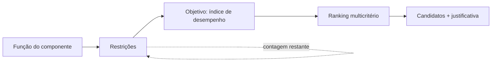

# Seleção determinística (Fase 4)

A seleção é o núcleo **reproduzível sem IA** do sistema. Todo o cálculo acontece
no backend, nas camadas puras `domain` e `calculations`, e qualquer análise pode
ser salva como um **estudo** e reaberta/reexecutada sem nenhuma dependência de
IA.

## Fluxo (método de Ashby)

Wizard: **Função → Restrições → Objetivo → Resultados**. A cada restrição, o
funil de eliminação mostra quantos candidatos restam.

## Restrições (`app/domain/filters.py`)

Operadores: `>`, `≥`, `<`, `≤`, faixa (`between`), fora da faixa (`outside`),
existe / não existe, pertence / não pertence a classe, texto contém. Combináveis
por **AND** (funil cumulativo) ou **OR** (união).

- Os limiares são informados em qualquer unidade compatível e **convertidos uma
  única vez** para a unidade canônica (via Pint) antes da comparação; unidade
  incompatível é rejeitada (HTTP 400).
- Uma restrição numérica sobre uma propriedade **ausente** no material o
  **elimina** — não se seleciona sobre dado que não se tem. Os operadores
  `existe`/`não existe` permitem filtrar por completude de dados de propósito.

## Índices de desempenho (`app/calculations/expressions.py`)

Um índice é uma expressão sobre os slugs das propriedades (ex.:
`modulo_young / densidade`). O avaliador é **seguro, sem `eval`**:

1. a expressão é convertida em AST (`ast.parse`);
2. um whitelist recursivo aceita apenas números, variáveis, `+ - * / **`, unário
   `+/-`, parênteses e as funções `sqrt`, `cbrt`, `abs` — qualquer outro nó
   (atributos, índices, chamadas, lambdas, comprehensions, strings) é rejeitado;
3. um interpretador manual percorre a árvore.

O **mesmo interpretador** roda em dois domínios numéricos: `float` (valor do
índice por material) e `Quantity` do Pint (análise dimensional — a dimensão do
índice é **derivada**, não presumida). Somar termos dimensionalmente
incompatíveis ou elevar uma grandeza a um expoente com dimensão é rejeitado.

Índices semeados (clássicos de Ashby): rigidez específica `E/ρ`, resistência
específica `σ/ρ`, viga leve `E^(1/2)/ρ`, placa leve `E^(1/3)/ρ`, componente leve
`σy/ρ` — cada um com função, geometria, objetivo, restrição e referência.

Casos-limite tratados: divisão por zero, resultado não finito, base negativa com
expoente fracionário (resultado complexo), overflow, variável sem valor →
o índice fica **indefinido** para aquele material (nunca um número inventado).

## Ranking multicritério (`app/domain/ranking.py`)

Soma ponderada normalizada. Cada critério tem uma direção (maior/menor é melhor),
um peso e um método de normalização (**min-máx** ou **vetorial**), ambos mapeando
para um escore "maior é melhor" em [0, 1]. Os pesos são renormalizados para somar
1; soma zero é erro. Cada candidato mostra a **contribuição por critério**.

- **Dados ausentes nunca são inventados:** um material sem valor para algum
  critério é **excluído do ranking e reportado** (com quais valores faltaram) —
  jamais preenchido com 0 ou média.
- **Análise de sensibilidade:** o ranking é recalculado sob pesos perturbados
  (pesos iguais; ênfase em cada critério) e o sistema informa se o 1º colocado
  muda — uma medida de robustez da recomendação.

A arquitetura (critérios com direção/peso/normalização + matriz de escores) foi
deixada genérica para acomodar **TOPSIS/AHP/PROMETHEE** no futuro sem reformatar
as entradas.

## Estudos salvos

`SelectionStudy` (+ `SelectionConstraint`, `RankingCriterion`) persiste função,
restrições, índice e critérios. Reabrir e reexecutar reproduz exatamente o mesmo
resultado, de forma determinística.

## Endpoints

| Método | Rota | Função |
|---|---|---|
| POST | `/api/selection/filter` | aplica restrições, retorna funil + candidatos |
| POST | `/api/selection/index` | valida e avalia uma expressão de índice |
| POST | `/api/selection/run` | pipeline completo: filtro → índice → ranking |
| GET/POST | `/api/selection/studies` | listar / criar estudos |
| GET/DELETE | `/api/selection/studies/{id}` | detalhe / excluir |
| POST | `/api/selection/studies/{id}/run` | reexecutar um estudo salvo |
| GET/POST | `/api/performance-indices` | catálogo de índices |

## Segurança

Nenhum `eval`/`exec`; expressões restritas a um AST whitelisted e limitadas em
tamanho. Conversões e comparações numéricas são determinísticas e finitas
(inf/NaN rejeitados na fronteira). Consultas parametrizadas via SQLAlchemy.
