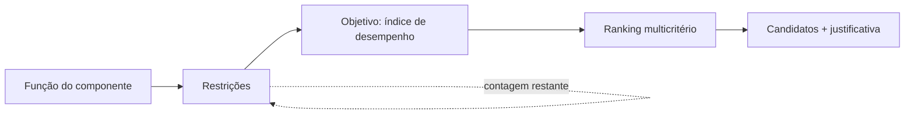

# Seleção determinística (Fase 4)

A seleção é o núcleo **reproduzível sem IA** do sistema. Todo o cálculo acontece
no backend, nas camadas puras `domain` e `calculations`, e qualquer análise pode
ser salva como um **estudo** e reaberta/reexecutada sem nenhuma dependência de
IA.

## Fluxo (método de Ashby)

Wizard: **Função → Restrições → Objetivo → Resultados**. A cada restrição, o
funil de eliminação mostra quantos candidatos restam.

## Restrições (`app/domain/filters.py`)

Operadores: `>`, `≥`, `<`, `≤`, faixa (`between`), fora da faixa (`outside`),
existe / não existe, pertence / não pertence a classe, texto contém. Combináveis
por **AND** (funil cumulativo) ou **OR** (união).

- Os limiares são informados em qualquer unidade compatível e **convertidos uma
  única vez** para a unidade canônica (via Pint) antes da comparação; unidade
  incompatível é rejeitada (HTTP 400).
- Uma restrição numérica sobre uma propriedade **ausente** no material o
  **elimina** — não se seleciona sobre dado que não se tem. Os operadores
  `existe`/`não existe` permitem filtrar por completude de dados de propósito.

### Grupos aninhados (M6)

O AND/OR acima é, na verdade, um caso particular: cada restrição vive dentro de
um **grupo** (`ConstraintGroup`), e é o grupo — não o estudo — que carrega o
operador AND/OR. Um grupo combina, sob seu próprio operador, as restrições que
tem diretamente e o resultado recursivo de cada grupo-filho que aninhar dentro
dele (`app/domain/filters.py::ConstraintGroupNode`,
`apply_constraint_tree`). Isso permite parênteses lógicos de verdade — por
exemplo, `(rigidez > 100 OU densidade < 3) E classe = "metais"` é um grupo
raiz AND com duas restrições/subgrupos: um subgrupo OR com as duas restrições
de rigidez e densidade, e a restrição de classe diretamente no grupo raiz.

Um estudo salvo antes do M6 — ou um estudo novo que não use aninhamento — é
exatamente um grupo raiz sem filhos, com sua lista plana de restrições e um
único operador: a mesma árvore de um nó só, avaliando **identicamente** ao
`apply_constraints` de antes. A migration `6845a9523f17` faz esse backfill
para todo estudo pré-existente (um `ConstraintGroup` raiz por estudo, com o
`combinator` que ele já tinha), e a prova de equivalência comportamental para
o caso de um único grupo raiz está nos testes de `filters.py`.

> **Limitação do M6, resolvida no P0-1:** `StudyOut` devolvia as restrições de
> um estudo aninhado como lista plana, então reabrir o estudo mostrava tudo
> achatado num único grupo AND, sem aviso nenhum. Nunca foi perda de dado — a
> árvore real seguia intacta no banco e era o que o estudo *executava* —, mas
> era uma lacuna de round-trip. `StageOut.root_group` agora devolve a árvore
> inteira, e `fromConstraintPayload` a reconstrói no editor.

## Estágios (P0-1)

Os grupos acima descrevem **um** filtro. Um estudo, porém, é uma **pilha
ordenada de estágios** (`SelectionStage`), e o resultado é a interseção dos
estágios **habilitados**, na ordem em que estão ([D-56](DECISIONS.md)).

**O estudo escolhe o universo do resultado** (P0-3, [D-58](DECISIONS.md)):
`material` (o padrão, e todo estudo salvo antes disso) ou `process`. É coluna e
não inferência — uma pilha de um único estágio de limites não nomeia universo
nenhum. Os tipos de estágio disponíveis decorrem dele: um estudo de materiais
aceita `limit`/`tree`/`process`, um de processos aceita `limit`/`tree`/`material`.

`tree` sempre anda a taxonomia do **próprio** universo do estudo, e o estágio de
travessia é o que nomeia o outro. Por isso **qual taxonomia valida `class_slugs`
decorre do universo, não do nome do campo**, que é o mesmo nos dois.

Há **quatro** tipos, e um estágio é uma pergunta só — enviar os campos de outro
tipo é recusado, não ignorado:

- **`limit`** — uma árvore de restrições, exatamente a do M6 acima. O estágio é
  dono de um `ConstraintGroup` raiz; todo grupo aninhado carrega o mesmo
  `stage_id`.
- **`tree`** — uma seleção de pastas da taxonomia (`class_slugs`). Com
  `include_descendants` (o padrão), escolher uma classe traz tudo abaixo dela.
  Isso é o que a restrição `in_class` **não** faz: ela compara o slug da própria
  classe do material, e como todo material mora numa folha, marcar um galho ali
  não admite ninguém. As duas continuam existindo porque respondem a perguntas
  diferentes — "exatamente nesta classe" e "nesta família".
- **`process`** — a junção com o universo de processos (P0-2,
  [D-57](DECISIONS.md)): mantém os materiais que **algum** processo selecionado
  serve. Leva duas listas, porque são namespaces diferentes: `process_slugs`
  (folhas, os processos em si) e `process_class_slugs` (pastas, as famílias),
  com `include_descendants` valendo para as pastas.

  **Algum, não todos.** "Soldável **e** forjável" são dois estágios, e a pilha
  já os intersecta — expressar isso duas vezes criaria duas formas de dizer a
  mesma coisa. E **ausência não passa**: material sem processo vinculado não
  sobrevive a um estágio de processo, pela mesma regra da restrição numérica —
  não se seleciona sobre dado que não se tem. Processo inativo também não admite
  ninguém, mesmo com o vínculo ainda no banco.

- **`material`** — a mesma junção do outro lado (P0-3), num estudo de processos:
  mantém os processos que servem **algum** material das pastas escolhidas, em
  `material_class_slugs`. **Só pastas**: um `Material` não tem slug para nomear
  uma folha, e o exercício 11 do manual seleciona uma pasta.

### Atributos de processo (P0-4)

Um estágio de limites num estudo de processos nomeia **atributos de processo**, e
não propriedades de material — a mesma regra que `tree` segue para pastas
([D-59](DECISIONS.md)). Os dois catálogos são tabelas separadas
(`process_attribute_definition`, `process_attribute_value`), com o trilho de
proveniência inteiro de `material_property_value`, e um slug de material num
estudo de processos é **404 nomeando o que não existe** — antes do P0-4 ele era
aceito, convertido, e o estágio então não admitia ninguém, sem explicação.

`ProcessAttributeKind` diz qual a forma do valor, e é o que decide como comparar:

- **`ESCALAR`** — um número, comparado exatamente como uma propriedade de
  material.
- **`ENVELOPE`** — uma **faixa de capacidade**, comparada por **alcance**: um
  processo que conforma peças de 0,1 a 10 kg atende "≥ 5 kg". Não é a regra do
  intervalo de material, e a diferença está no dado: lá a faixa é dispersão em
  torno de um valor verdadeiro e o ponto médio o representa; aqui todo ponto de
  dentro é de fato alcançável. `between` sobre envelope é **sobreposição**, não
  contenção. A regra aparece no rótulo da restrição ("alcance do envelope"), na
  coluna *Tipo de valor* da folha de proveniência e na nota dela.
- **`DISCRETO`** — rótulos de um vocabulário fechado (`allowed_labels`),
  respondidos por pertinência: `has_any_label` / `has_no_label`. O operador
  negativo **não** libera ausência — processo sem `forma` cadastrada não é "um
  processo cuja forma não é maciça" —, e rótulo fora do vocabulário é 404
  nomeando o rótulo, nunca zero resultado.

**Ranqueamento e índice passaram a valer num estudo de processos**, e a recusa de
D-58 foi retirada em vez de reescrita. O que se recusa agora é atributo
inexistente e atributo **discreto** onde se exige magnitude: como critério de
ranqueamento (um rótulo não é melhor que outro, então não há ordem) e dentro de
expressão de índice (pelo nome, não pelo erro de dimensão que a unidade NULL
produziria depois). Um envelope é ranqueado pelo **ponto representativo** — o
mesmo `normalized_value` de sempre — enquanto continua sendo filtrado pelos
limites.

`enabled` é coluna e não exclusão: desligar e religar um estágio é *como* se vê
o efeito de um critério. Um estágio desligado não estreita, mas continua no
relatório e ainda diz **quantos admitiria sozinho** — a pergunta que desligar
faz.

A migration `a1c4f2e8b7d3` dá a cada estudo pré-existente exatamente um estágio
`limit` habilitado na posição 0, dono do grupo raiz que o M6 já lhe dera. Com um
estágio, o funil plano sai **idêntico** ao de antes: sem prefixo, sem linha
extra. Com mais de um, cada linha nomeia seu estágio.

A migration `b7e2d9c4a105` acrescenta `process_slugs` e `process_class_slugs`
do mesmo jeito aditivo: nullable, backfill com `[]`, então NOT NULL. Um estágio
salvo antes do P0-2 continua sendo exatamente o que era.

Pilha vazia não existe em lugar nenhum: nem no banco, nem na API (`stages: []`
é 400), nem na tela (o último estágio não pode ser removido). Um estudo cujas
linhas descrevem estágio nenhum degrada para um estágio sobre a árvore inteira,
em vez de admitir o catálogo todo em silêncio.

O funil nomeia **qual** pergunta cada estágio de pergunta única fez:
`in_tree` para o de árvore, `in_process` para o de processos e `in_material`
para o de materiais. Chamar os três da mesma coisa diria ao leitor que a seleção
filtrou por algo que ela não filtrou.

## Índices de desempenho (`app/calculations/expressions.py`)

Um índice é uma expressão sobre os slugs das propriedades (ex.:
`modulo_young / densidade`). O avaliador é **seguro, sem `eval`**:

1. a expressão é convertida em AST (`ast.parse`);
2. um whitelist recursivo aceita apenas números, variáveis, `+ - * / **`, unário
   `+/-`, parênteses e as funções `sqrt`, `cbrt`, `abs` — qualquer outro nó
   (atributos, índices, chamadas, lambdas, comprehensions, strings) é rejeitado;
3. um interpretador manual percorre a árvore.

O **mesmo interpretador** roda em dois domínios numéricos: `float` (valor do
índice por material) e `Quantity` do Pint (análise dimensional — a dimensão do
índice é **derivada**, não presumida). Somar termos dimensionalmente
incompatíveis ou elevar uma grandeza a um expoente com dimensão é rejeitado.

Índices semeados (clássicos de Ashby): rigidez específica `E/ρ`, resistência
específica `σ/ρ`, viga leve `E^(1/2)/ρ`, placa leve `E^(1/3)/ρ`, componente leve
`σy/ρ` — cada um com função, geometria, objetivo, restrição e referência.

Casos-limite tratados: divisão por zero, resultado não finito, base negativa com
expoente fracionário (resultado complexo), overflow, variável sem valor →
o índice fica **indefinido** para aquele material (nunca um número inventado).

## Ranking multicritério (`app/domain/ranking.py`)

Soma ponderada normalizada. Cada critério tem uma direção (maior/menor é melhor),
um peso e um método de normalização (**min-máx** ou **vetorial**), ambos mapeando
para um escore "maior é melhor" em [0, 1]. Os pesos são renormalizados para somar
1; soma zero é erro. Cada candidato mostra a **contribuição por critério**.

- **Dados ausentes nunca são inventados:** um material sem valor para algum
  critério é **excluído do ranking e reportado** (com quais valores faltaram) —
  jamais preenchido com 0 ou média.
- **Análise de sensibilidade:** o ranking é recalculado sob pesos perturbados
  (pesos iguais; ênfase em cada critério) e o sistema informa se o 1º colocado
  muda — uma medida de robustez da recomendação.

A arquitetura (critérios com direção/peso/normalização + matriz de escores) foi
deixada genérica para acomodar **TOPSIS/AHP/PROMETHEE** no futuro sem reformatar
as entradas.

## Estudos salvos

`SelectionStudy` (+ `SelectionConstraint`, `RankingCriterion`) persiste função,
restrições, índice e critérios. Reabrir e reexecutar reproduz exatamente o mesmo
resultado, de forma determinística.

## Endpoints

| Método | Rota | Função |
|---|---|---|
| POST | `/api/selection/filter` | aplica restrições, retorna funil + candidatos |
| POST | `/api/selection/index` | valida e avalia uma expressão de índice |
| POST | `/api/selection/run` | pipeline completo: filtro → índice → ranking |
| GET/POST | `/api/selection/studies` | listar / criar estudos |
| GET/DELETE | `/api/selection/studies/{id}` | detalhe / excluir |
| POST | `/api/selection/studies/{id}/run` | reexecutar um estudo salvo |
| GET/POST | `/api/performance-indices` | catálogo de índices |

## Segurança

Nenhum `eval`/`exec`; expressões restritas a um AST whitelisted e limitadas em
tamanho. Conversões e comparações numéricas são determinísticas e finitas
(inf/NaN rejeitados na fronteira). Consultas parametrizadas via SQLAlchemy.
