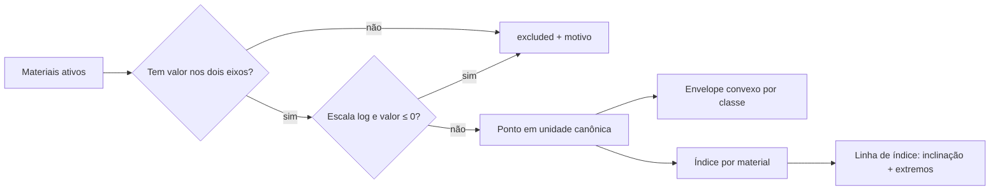

# Visualização (Fase 5)

Mapas de propriedades no estilo Ashby e comparação multicritério. A regra que
organiza toda a fase é simples: **o servidor decide, o cliente desenha.**
Inclinações, extremos de linhas de índice, envelopes de classe, conversões de
unidade e escores normalizados são calculados no backend, em unidades canônicas;
o frontend recebe coordenadas prontas e apenas as traça.

## Por que o cálculo geométrico fica no backend

Uma linha de índice é um resultado numérico, não um enfeite. Se o frontend
"chutasse" a inclinação de `E^(1/2)/ρ` como 2, o número deixaria de ser
rastreável, não teria teste e divergiria silenciosamente da expressão caso ela
mudasse. Aqui a inclinação é **derivada da própria expressão**
(`app/calculations/powerlaw.py`) e testada. Ver
[`adr/0004-geometria-de-graficos-no-backend.md`](adr/0004-geometria-de-graficos-no-backend.md).

## Mapa de propriedades (`POST /api/charts/property-map`)



### Pontos

Cada ponto carrega, além de `x`/`y` (valor representativo em unidade canônica):

- **Limites do intervalo** (`x_min`/`x_max`, `y_min`/`y_max`) **convertidos para
  a unidade canônica**. Os intervalos são gravados na unidade *original*; plotar
  40–60 MPa num eixo em Pa sem converter colocaria a barra de erro a nove ordens
  de grandeza do ponto. A conversão usa `to_canonical` (valor absoluto).
- **Incerteza** convertida como **diferença**, não como valor absoluto:
  `to_canonical_delta` converte as duas pontas e subtrai, de modo que ±5 °C
  continua ±5 K em vez de virar ±278 K.
- **Qualidade do dado** de cada eixo, exibida no tooltip.
- **Valor do índice** e, quando indefinido, o motivo.

### Exclusões

Nenhum material some em silêncio. Quem não pode ser plotado volta em `excluded`
com o motivo — "Sem valor para: Condutividade térmica." ou "Valor não positivo:
indefinido em escala logarítmica." — e a interface lista todos abaixo do gráfico.
O cabeçalho mostra sempre `plotados de considerados`.

### Envelopes por classe

O envelope é o **fecho convexo** dos materiais daquela classe
(`app/domain/geometry.py`, monotone chain). É a envoltória honesta de um conjunto
finito: não afirma nada sobre regiões onde não há dado cadastrado.

O fecho é calculado **no espaço exibido**. Num mapa log-log os pontos são
transformados por `log10`, o fecho é calculado ali e os vértices voltam por
`10^v` — porque o fecho convexo dos logaritmos não é o logaritmo do fecho
convexo. Casos degenerados são devolvidos como são: uma classe com um material
vira um vértice; com dois, um segmento.

### Linha de índice

Um índice `M = C · X^a · Y^b` tem, em escala log-log, contorno reto:

```
log M = log C + a·log X + b·log Y   ⟹   inclinação = −a/b
```

`app/calculations/powerlaw.py` reescreve a expressão já validada como um
**monômio** (coeficiente + um expoente por variável), percorrendo o mesmo AST
whitelisted usado pelo avaliador. Daí saem `a`, `b` e `C`.

| Índice | Eixos (y × x) | Inclinação |
|---|---|---|
| `E / ρ` | E × ρ | 1 |
| `sqrt(E) / ρ` | E × ρ | 2 |
| `cbrt(E) / ρ` | E × ρ | 3 |
| `σ / ρ` | σ × ρ | 1 |

A linha **não** é traçada — e o motivo é dito — quando:

- a expressão não é um monômio (`E + ρ`, `abs(E)`, expoente variável): não existe
  contorno reto;
- o índice depende de uma terceira propriedade: o contorno dependeria de um eixo
  invisível;
- o índice não depende de nenhum dos dois eixos, ou é identicamente nulo.

Nesses casos os **valores** do índice continuam sendo devolvidos por material —
só a reta é omitida.

Quando o índice não depende do eixo Y, o contorno é uma **reta vertical**
(`orientation: "vertical"`); quando não depende do eixo X, é horizontal
(inclinação 0), que o mesmo caso oblíquo já cobre.

#### Níveis

Um nível é um valor de `M`. Pode vir de um número informado ou, mais útil, do
**índice de um material escolhido** — a reta passa então exatamente por ele, que
é justamente a leitura de Ashby: deslocar uma reta de inclinação conhecida até
isolar os candidatos superiores. Para cada nível o backend devolve os dois
extremos do segmento e `superior_material_ids`, os materiais no lado favorável
segundo o objetivo (`maximize` → `M ≥ nível`; `minimize` → `M ≤ nível`).

Retas de índice vivem no quadrante positivo (uma lei de potência com expoente
fracionário não tem ramo real fora dele), então o segmento é traçado sobre a
faixa positiva dos pontos plotados.

## Comparação (`POST /api/charts/compare`)

Uma matriz (materiais × propriedades) que alimenta cinco leituras da mesma
verdade: tabela, barras, radar, coordenadas paralelas e heatmap.

- A normalização reutiliza `normalize_column` de `app/domain/ranking.py` — a
  mesma função do ranking, para que uma barra no comparador e um escore no
  ranking não possam divergir. Direção vem de `better_direction`.
- Propriedades **sem direção preferida** (`NEUTRAL`) são normalizadas por
  posição relativa, e isso é dito numa observação: a escala indica posição, não
  mérito.
- **Célula ausente permanece ausente.** `value` e `normalized` são `null`, e
  cada gráfico a representa como lacuna: o heatmap deixa o quadrado vazio
  (`hoverongaps: false`), as coordenadas paralelas quebram a linha
  (`connectgaps: false`) e o radar **omite o material inteiro**, listando quem
  ficou de fora. Um zero ali equivaleria a afirmar "é o pior", que é uma
  invenção.
- Cada célula carrega a proveniência completa: valor original, unidade original,
  método de conversão, incerteza, faixa, qualidade e fonte.
- A ordem pedida é preservada — ela pode carregar significado (um ranking).

### Coordenadas paralelas sem `parcoords`

O traçado `parcoords` do Plotly não sabe expressar uma coordenada ausente:
seria preciso inventar um valor. A visualização é feita como gráfico de linhas
sobre um eixo categórico com `connectgaps: false`, onde a falta simplesmente
interrompe a linha.

## Exportação de imagens

Botões **PNG** e **SVG** em cada gráfico, via `Plotly.toImage` sobre a instância
que o `react-plotly.js` já carregou (sem segunda cópia da biblioteca no bundle).
PNG sai em 2× para leitura impressa; SVG é vetorial e é a escolha certa para a
monografia. O nome do arquivo descreve a figura
(`mapa-modulo-de-young-densidade-log.svg`).

## Um eixo que é um índice (Fase 9, [D-40](DECISIONS.md))

Um eixo do mapa deixou de precisar ser uma propriedade cadastrada: ele pode ser
um **índice de desempenho** — do catálogo, pelo slug, ou uma expressão
personalizada avaliada pelo mesmo interpretador sem `eval`. É o que permite ler
"índice × custo" em vez de só "módulo × densidade".

Duas consequências que não são detalhe de implementação:

- **A linha de índice sobreposta e o eixo-índice são mutuamente exclusivos**,
  por desenho. Um contorno de índice constante sobre um eixo que já *é* aquele
  índice seria uma reta trivial se dizendo informativa — a interface impede a
  combinação em vez de desenhá-la.
- **Um material sem valor para alguma variável da expressão não vira ponto**,
  entra em `excluded` com o motivo escrito. É a mesma regra de dado ausente do
  resto do sistema: a lacuna é nomeada, nunca preenchida.

## O painel de indicadores (Fase 9, [D-39](DECISIONS.md))

`/painel` responde "quanto do catálogo está preenchido, e com que qualidade" em
cinco figuras: cobertura geral, composição por tipo de evidência, cobertura por
classe, ranking de lacunas e distribuição por propriedade com **box-plot**.

Quartis, medianas, extremos e percentuais são computados no backend
(`app/calculations/statistics.py`), como manda o [ADR 0004](adr/0004-geometria-de-graficos-no-backend.md)
— um quartil é cálculo, e um quartil calculado no navegador poderia discordar do
que a exportação diz. E as **duas paletas não se confundem**: a ordinal de
qualidade do dado (medido → importado → estimado → ausente) não é a categórica
de classes (Okabe–Ito), porque uma responde a confiança e a outra a identidade.

Uma classe sem nenhum valor registrado para a propriedade escolhida é
**nomeada em texto**, não desenhada como caixa de altura zero.

## Endpoints

| Método | Rota | Função |
|---|---|---|
| POST | `/api/charts/property-map` | pontos, envelopes, exclusões e linha de índice |
| POST | `/api/charts/compare` | matriz normalizada para as cinco visualizações |
| GET | `/api/dashboard/overview` | cobertura geral, por classe e por propriedade |
| GET | `/api/dashboard/distribution/{property_slug}` | quartis por classe para uma propriedade |

Os dois primeiros são POST porque a entrada é estruturada (par de eixos, filtro
de classes, conjuntos de materiais, expressão do índice e níveis) e não caberia
legivelmente numa query string. Os dois do painel são GET porque a entrada é um
slug ou nada.

## Interface

- **`/mapas`** — eixos, escala linear/log, filtro por classe, envelopes, barras
  de erro/intervalos, rótulos, linha de índice com nível por material e
  exportação. Aceita `?materiais=1,2,3&destaque=1` para receber os candidatos de
  uma seleção.
- **`/comparar`** — seleção de até 12 materiais e 12 propriedades, alternância
  entre as cinco visualizações e escolha da normalização. Aceita
  `?materiais=1,2,3`.
- A tela de **Resultados** da seleção leva para as duas, preservando os
  candidatos e destacando o 1º colocado.

## Limites conhecidos

- Envelopes são fechos convexos, não elipses ajustadas; com poucos materiais por
  classe a forma é literal, e é isso que se quer numa base pequena.
- O radar exige materiais completos nas propriedades escolhidas.
- Comparação limitada a 12 × 12 (constantes em `app/schemas/charts.py`); acima
  disso a figura deixa de ser legível antes de ficar cara.
- Exportação de **dados** (CSV/XLSX/PDF) é da Fase 7; aqui só imagens.
