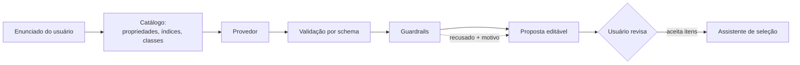

# Camada de IA (Fase 6)

Opcional, desacoplada e **incapaz de produzir um número**. Esta fase entrega o
que a proposta delimita no item 4.3: interpretar enunciados, sugerir
propriedades e índices **já cadastrados**, recomendar um gráfico e redigir
explicações sobre resultados **já calculados** — nada além disso.

O sistema funciona integralmente com a camada desligada. Nenhum resultado
numérico, nenhum ranking e nenhum gráfico depende dela.

Três provedores atendem o mesmo contrato: o **simulado** (padrão, determinístico,
sem rede) e dois que falam com o **Claude** — pela API da Anthropic ou pelo
Claude Code instalado na máquina. Trocar de um para outro é trocar uma variável
de ambiente; nada do que está abaixo muda, e é exatamente isso que se quer
demonstrar.

## O caminho de uma requisição

O provedor fica no meio, sem sessão de banco, sem avaliador de expressões e sem
acesso a valores calculados além dos que lhe são entregues. Ele **não pode**
consultar o catálogo à vontade, executar uma expressão nem alterar um número.

## Os guardrails (`app/ai/guardrails.py`)

Redação de prompt não garante nada; código garante. Toda saída de provedor —
simulado ou não — passa por estas regras, e o que reprova é **descartado e
reportado**, nunca corrigido em silêncio.

### 1. Entidades precisam existir

Propriedade, classe, índice ou eixo sugerido tem de nomear algo já cadastrado. A
camada **seleciona**; ela não cria. Em particular, a IA não é autorizada a
escrever expressões de índice: só pode apontar para um índice do catálogo, cuja
expressão já passou pelo parser seguro e pela análise dimensional.

### 2. Números precisam estar ancorados

Todo número de uma restrição proposta tem de **aparecer no enunciado do
usuário**. É isto que torna “a IA não calcula” verificável em vez de retórico.

A regra recusa até aritmética *correta*: um enunciado que diz “300 °C” ancora
`300 degC`, mas **não** ancora `573.15 kelvin`. A conversão é trabalho do
backend — e só o backend registra a trilha (valor original, unidade original,
valor normalizado, método). Uma IA que convertesse silenciosamente quebraria a
rastreabilidade mesmo acertando a conta.

O reconhecimento de números é generoso quanto à *leitura* e estrito quanto à
*origem*: “1.500” pode ser 1500 (agrupamento pt-BR) ou 1,5 (decimal en-US), e o
enunciado não diz qual, então as duas leituras ancoram.

### 3. Unidades precisam ser compatíveis

O limiar tem de converter para a unidade canônica da propriedade, via Pint. Uma
temperatura “no mínimo 300 GPa” é recusada.

### 4. Limiar dimensionado precisa declarar a unidade

Uma restrição numérica sobre propriedade com dimensão **não pode** omitir a
unidade. A jusante, unidade ausente significa “já está na unidade canônica”, e
numa escala com offset isso lê o enunciado ao contrário: “no mínimo 300 °C”
viraria ≥ 300 K, ou seja −173 °C — nenhuma restrição. Propriedades adimensionais
(dureza, custo por massa) são isentas, porque ali não há o que confundir.

O provedor simulado coopera com a regra em vez de esbarrar nela: quando lê um
limite mas não identifica a unidade, ele **não propõe** a restrição e devolve
uma pergunta aberta citando a cláusula. Recusar-se a adivinhar é a mesma
disciplina que impede a camada de converter.

> Esta regra nasceu de um defeito real, encontrado ao demonstrar a fase: “no
> mínimo 300 graus C” era proposto com `unit: null` e virava 300 K em silêncio.
> As regras 1 a 3 não o pegavam — o número estava ancorado e kelvin é compatível
> com a propriedade.

### 5. Prosa não pode introduzir números

Uma explicação só pode citar cifras que o pipeline determinístico produziu. A
verificação é por *token escrito*: uma figura só é invenção quando **nenhuma**
leitura dela foi calculada. Inteiros pequenos são isentos — “3 de 5 candidatos”,
“o 1º colocado” descrevem o formato do resultado, não uma medição. Números já
presentes em strings do próprio backend (a dimensão `[length] ** 2.5`, o rótulo
de uma restrição) contam como calculados, porque são.

Se a prosa citar algo fora disso, a resposta inteira é descartada com HTTP 400.

## Contexto do Cérebro (`app/knowledge/`)

Opcional sobre o opcional. Quando o provedor não é o `mock`,
`AIService._retrieve` consulta o `Cérebro/` já ingerido — busca léxica e
semântica fundidas por *reciprocal rank fusion* (`app/knowledge/retrieval.py`)
— pelos trechos mais relevantes ao enunciado (em `interpret()`) ou ao estudo
(em `explain()`), e os anexa ao prompt como um bloco numerado de "Trechos de
referência" (`app/ai/prompts.py`, `_reference_block`). `provider.simulated` é
o portão inteiro: o `mock` nunca aciona essa busca, pelo mesmo motivo de
sempre — ele é descrito como determinístico e sem rede, e ligar retrieval nele
quebraria as duas coisas, sem ganho nenhum para a maioria da suíte, que roda
com `AI_PROVIDER=mock`.

### A garantia central: trecho recuperado é vocabulário, nunca número

Um trecho pode ensinar ao modelo o que "tenacidade à fratura" quer dizer; ele
não pode virar o `300` de uma restrição. Isso não é disciplina de prompt —
embora `prompts.py` também peça isso, na regra 4a — é estrutural:
`guardrails.check_constraint` e `guardrails.ungrounded_numbers` só leem
`context.statement`/`context.numbers`; nenhuma das duas jamais recebe
`context.retrieved`, o campo em que os trechos chegam. Um número que exista só
num trecho recuperado e não no enunciado do usuário é recusado do mesmo jeito
que qualquer outro número inventado — a regra 2 (ancoragem numérica) continua
valendo sem precisar saber que o retrieval existe. É essa ausência de leitura,
não uma convenção, que faz a garantia resistir a alguém adicionando retrieval
em outro lugar sem entender a regra.

### Busca híbrida (`app/knowledge/retrieval.py`)

- **Léxica** — BM25 sobre `search_text` (texto normalizado na ingestão), sem
  rede.
- **Semântica** — opcional, roda só quando `KNOWLEDGE_EMBEDDING_BASE_URL` e
  `KNOWLEDGE_EMBEDDING_MODEL` estão configurados; degrada para léxico puro,
  silenciosamente para quem chama, se a chamada de embedding falhar. Um trecho
  achado por metade do mecanismo vale mais que nenhum, e um provedor de
  embeddings instável não pode derrubar toda chamada de IA por isso.
- **Fusão** — *reciprocal rank fusion*: `score = Σ 1/(60 + posição)` por lista
  em que o trecho aparece, `k = 60` fixo — o valor a que a literatura de RRF já
  convergiu, sem parâmetro para calibrar contra nada ainda. O resultado corta
  em `KNOWLEDGE_RETRIEVAL_TOP_K` (padrão 5).

A ingestão que alimenta essa busca é `app/knowledge/service.py` — idempotente
por checksum, um documento do `Cérebro/` por linha — e não produz número
nenhum sozinha; o princípio 2 do `CLAUDE.md` continua valendo tanto quanto
antes de ela existir. Ver [D-45](DECISIONS.md) sobre por que o material
licenciado que ela indexa está hospedado em `main`.

### Citação verificada, só em `explain()`

`explain()` pode citar os trechos que efetivamente usou: o esquema pede só o
**índice** numérico do trecho (`[1]`, `[2]`…), nunca título ou texto — o
mínimo que dá para checar contra o que foi de fato entregue ao modelo.
`guardrails.check_citations` descarta qualquer índice fora do intervalo dos
trechos recuperados **naquela chamada**. Ao contrário de `ungrounded_numbers`,
que derruba a explicação inteira quando encontra uma cifra inventada, aqui só
a citação inválida é removida — é metadado sobre a própria resposta, não uma
alegação numérica, e descartar o índice ruim não custa ao leitor nada que ele
fosse usar. `AIService.explain` traduz o que sobrevive em `CitedSourceOut`
(título do documento e páginas), que é o que a interface mostra.

`interpret()` não ganha citação: ali `retrieved` serve só para o modelo mapear
vocabulário do enunciado para slugs do catálogo — a UI já mostra, para cada
restrição sugerida, o `evidence` copiado do próprio enunciado do usuário, e
não há de onde um trecho do Cérebro entraria nessa tela.

## Provedor simulado (`app/ai/mock.py`)

É a implementação de referência e a que o produto entrega. Lê o enunciado com
regras lexicais sobre o catálogo vivo e é **determinística**: o mesmo enunciado
produz sempre a mesma leitura — condição para que a camada possa aparecer num
argumento de reprodutibilidade.

Reconhece:

- **função** (viga, placa, tirante, eixo, mola, vaso de pressão);
- **objetivo** (minimizar massa, minimizar custo, maximizar rigidez ou
  resistência);
- **propriedades citadas**, casando o texto com o nome, o slug e o símbolo de
  cada propriedade cadastrada, mais um pequeno vocabulário em português;
- **restrições**, cláusula a cláusula, com comparador (“no mínimo”, “acima de”,
  “até”, “entre X e Y”, `≥`…), valor **copiado literalmente** e unidade escrita;
- **índices do catálogo**, pontuados por função, objetivo e propriedades em
  comum — a sobreposição de propriedades sai de `as_monomial`, o mesmo módulo
  que deriva a inclinação das linhas de índice;
- **o mapa** em que o índice líder vira uma reta: o denominador vai para o eixo
  X, o numerador para o Y, escala logarítmica.

Suas limitações são declaradas, não escondidas. Quando não reconhece uma
restrição, um objetivo ou um índice, diz isso em `open_questions` em vez de
adivinhar. E cada índice sugerido justifica **apenas o que de fato casou** com
ele: um índice de placa que compartilha só o objetivo não alega também
corresponder à função “viga”.

## Provedores reais (`app/ai/claude_api.py`, `claude_cli.py`, `openai_compat.py`)

Três, todos atrás do mesmo `AIProvider` — a escolha entre eles é de quem
instala, não do código:

| `AI_PROVIDER` | Como fala com o modelo | Credencial |
|---|---|---|
| `claude-api` | SDK oficial `anthropic`, `POST /v1/messages` | chave própria (`ANTHROPIC_API_KEY` ou `AI_API_KEY`) |
| `claude-cli` | o `claude` já instalado na máquina, em `--print` | a sessão do Claude Code, já autenticada |
| `openai-compat` | `POST {AI_BASE_URL}/chat/completions` | `AI_API_KEY`, e **vazio é válido** — um Ollama local não quer cabeçalho `Authorization` |

O `openai-compat` é o caminho gratuito, e é um **protocolo**, não um fornecedor
([D-36](DECISIONS.md)): o mesmo código atende Groq no plano gratuito, um Ollama
rodando nesta máquina, OpenRouter ou a OpenAI, e quem escolhe é `AI_BASE_URL` —
que **não tem padrão**, porque um padrão escolheria um fornecedor pelo operador.
O aviso que o usuário vê nomeia **o host** de destino, nunca o caminho: um
caminho de gateway pode carregar token.

O `claude-cli` existe porque uma assinatura do Claude é a credencial que a maior
parte das pessoas deste projeto já tem. A chamada é deliberadamente hostil a
surpresas: sem shell, o enunciado vai por **stdin** e nunca na linha de comando,
todas as ferramentas desligadas, `--safe-mode` para que nenhum CLAUDE.md, hook,
plugin, skill ou servidor MCP da máquina participe da resposta, sessão não
persistida e diretório de trabalho neutro. Ele faz uma pergunta e lê uma
resposta; não pode virar um jeito de executar coisa alguma.

O que os provedores reais têm em comum está em `app/ai/model_base.py` — o nome
não traz "claude" de propósito, porque a garantia é da camada e não de um
fornecedor ([D-36](DECISIONS.md)) —, e é ali que ela mora
([D-35](DECISIONS.md)):

- **O modelo escolhe um índice pelo slug e mais nada.** Nome, expressão e
  objetivo são lidos do catálogo *depois* da resposta. Não é uma checagem: o
  campo não existe no esquema, então por esse caminho um modelo não tem onde
  escrever uma expressão de índice.
- **As ressalvas da explicação são do backend** (`app/ai/caveats.py`, o mesmo
  módulo que o simulado usa). O esquema enviado ao modelo pede `summary` e
  `paragraphs`; ressalva não está lá para ele deixar de escrever.
- **Slug inventado atravessa.** Filtrá-lo no provedor seria mais limpo e seria
  pior: o guardrail o recusa **e diz por quê**, e é vendo o que foi recusado que
  se passa a acreditar no que não foi.

A saída é pedida como JSON contra um esquema montado a partir do catálogo vivo
(*structured outputs* na API, `--json-schema` no CLI), com os slugs legítimos
enumerados. Isso reduz recusas; não substitui nenhuma. Tudo continua passando
pelos guardrails.

**Um provedor real não é determinístico.** O mesmo enunciado pode ser lido de
dois jeitos, e é por isso que `mock` continua sendo o padrão — é sobre ele que o
argumento de reprodutibilidade se apoia. A ressalva mostrada ao usuário diz
isso; o cálculo, esse não varia, porque não passa por aqui.

## Configuração

| Variável | Padrão | Efeito |
|---|---|---|
| `AI_PROVIDER` | `mock` | vazio desliga a camada; `mock`, `claude-api` ou `claude-cli` |
| `AI_API_KEY` | vazio | só para `claude-api`; vazio deixa o SDK ler `ANTHROPIC_API_KEY` — preferível, porque a chave não passa pelas settings |
| `AI_MODEL` | `claude-opus-5` | modelo dos dois provedores reais |
| `AI_TIMEOUT_SECONDS` | `90` | o CLI precisa da ponta alta: ele sobe um processo antes de ter um modelo a quem perguntar |
| `AI_MAX_OUTPUT_TOKENS` | `16000` | teto de uma resposta, raciocínio e texto juntos |
| `AI_CLI_COMMAND` | `claude` | executável do `claude-cli`, resolvido no PATH |

O pacote `anthropic` é um extra: `pip install -e ".[ai]"`. Nem `mock` nem
`claude-cli` precisam dele, e o produto determinístico não precisa de nada.

Um nome desconhecido **falha alto**, em vez de cair no simulado: um ambiente
nunca deve acreditar que fala com um modelo quando não fala. Falta de
credencial, tempo esgotado, recusa do modelo e resposta truncada também falham
alto, cada uma com a mensagem que diz qual botão girar.

## Endpoints

| Método | Rota | Função |
|---|---|---|
| GET | `/api/ai/status` | a camada está ligada? é simulada? |
| POST | `/api/ai/interpret` | enunciado → proposta editável |
| POST | `/api/ai/explain` | estudo salvo → prosa sobre o resultado calculado |

`/status` responde mesmo com a camada desligada (dizendo isso); as demais rotas
retornam 400 — estar desligada é um estado de configuração, não uma falha.

`/explain` aceita **apenas um id de estudo**. O serviço reexecuta o estudo pelo
pipeline determinístico e escreve sobre os números daquela execução; não há como
o chamador injetar valores para a IA descrever.

## Interface

- **`/selecao`, etapa 1** — painel “Interpretar enunciado (opcional)”. A
  proposta chega com cada item marcável: função, objetivo, variáveis livres,
  cada restrição (com o **trecho do enunciado** que a originou) e o índice. Nada
  entra no assistente antes de “Aplicar selecionados”, e as restrições são
  **acrescentadas**, nunca substituem o que o usuário já escreveu.
- As sugestões **recusadas pelos guardrails** aparecem com o motivo. Ver o que
  foi recusado faz parte de confiar no que não foi.
- **Estudos salvos** — botão “Explicar resultado”, com as ressalvas sempre
  visíveis (a ferramenta não substitui validação experimental; ausência de dado
  não é valor ruim; se o 1º colocado muda com os pesos, isso é dito).

## Adicionar mais um provedor

Implementar `AIProvider` (dois métodos) e registrá-lo em `app/ai/factory.py`.
Nada mais muda: serviço, guardrails, contratos e interface seguem iguais, e a
remoção do provedor devolve o sistema ao estado determinístico puro. Um provedor
que precise de configuração sobrescreve `from_settings`; é o único ponto por
onde configuração alcança um provedor, e a interface continua recebendo apenas o
catálogo e o texto.

Para outro modelo de linguagem, o caminho curto é herdar de `ModelProviderBase`
e implementar só `_complete` — prompt, esquema e leitura da resposta já estão
prontos e são os mesmos dos três provedores reais existentes. Foi exatamente
esse caminho que o `openai-compat` percorreu, e ele é a demonstração de que a
base não é do Claude: nenhum arquivo de serviço, guardrail ou interface mudou
para acomodá-lo ([D-36](DECISIONS.md)).

Um provedor real deve receber a instrução de **citar o número do usuário, na
unidade do usuário**, e de escolher índices por slug — é o que
`app/ai/prompts.py` faz, em português, porque tudo que sai dali é lido em
português. Se ele desobedecer, o guardrail recusa. Esse é o ponto: a garantia
não depende da obediência, e o prompt existe para diminuir a quantidade de
sugestões perdidas, não para servir de garantia.

## Testes

- `test_ai_guardrails.py` — as regras contra saídas hostis: número não ancorado,
  conversão correta porém não ancorada, unidade incompatível, propriedade e
  índice inventados, eixos repetidos, prosa com cifra inventada.
- `test_ai_api.py` — o provedor simulado ponta a ponta (leitura, determinismo,
  restrições que o pipeline determinístico de fato aceita) e um **provedor
  mentiroso** injetado para provar que tudo que ele inventa é barrado e
  reportado.
- `test_ai_claude.py` — os provedores reais, com a resposta do modelo
  **roteirizada**: nenhum teste toca a rede, porque o que está sob teste é que
  a resposta de um modelo é tratada como a de qualquer outro provedor. Cobre a
  conversão correta porém recusada, a expressão inventada que o catálogo
  sobrescreve, as ressalvas que o modelo não consegue omitir, e o formato exato
  do comando do CLI — inclusive que o enunciado não aparece nele.

  O teste mais afiado devolve o **próprio bloco de dados do prompt** como prosa.
  Se alguma cifra que o modelo vê não puder ser citada, o guardrail descarta uma
  resposta que fez exatamente o que foi mandado — uma armadilha que só apareceria
  na frente do usuário. Foi ele que revelou que nome de material é saída do
  pipeline como qualquer rótulo: escrever "Aço AISI 1020 lidera" não é inventar
  1020, e sem isso bastaria nomear o vencedor para perder a explicação inteira.
- `test_knowledge_retrieval.py` — BM25 sozinho, semântico sozinho (com fake de
  embeddings), fusão RRF, degradação para léxico puro quando o embedding falha,
  `top_k` respeitado. `test_ai_service.py` prova o portão do retrieval:
  `interpret`/`explain` só chamam `knowledge_search` quando
  `provider.simulated is False`, e o `mock` nunca aciona rede nenhuma. Um teste
  dedicado cobre a garantia central desta seção — um número presente **só** num
  trecho recuperado, ausente do enunciado do usuário, continua sendo recusado
  como restrição, exatamente como antes de o retrieval existir — e outro cobre
  `check_citations`: índice de citação fora do conjunto recuperado é descartado,
  índice válido passa.
