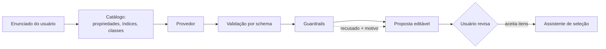

# Camada de IA (Fase 6)

Opcional, desacoplada e **incapaz de produzir um número**. Esta fase entrega o
que a proposta delimita no item 4.3: interpretar enunciados, sugerir
propriedades e índices **já cadastrados**, recomendar um gráfico e redigir
explicações sobre resultados **já calculados** — nada além disso.

O sistema funciona integralmente com a camada desligada. Nenhum resultado
numérico, nenhum ranking e nenhum gráfico depende dela.

## O caminho de uma requisição

O provedor fica no meio, sem sessão de banco, sem avaliador de expressões e sem
acesso a valores calculados além dos que lhe são entregues. Ele **não pode**
consultar o catálogo à vontade, executar uma expressão nem alterar um número.

## Os quatro guardrails (`app/ai/guardrails.py`)

Redação de prompt não garante nada; código garante. Toda saída de provedor —
simulado ou não — passa por estas regras, e o que reprova é **descartado e
reportado**, nunca corrigido em silêncio.

### 1. Entidades precisam existir

Propriedade, classe, índice ou eixo sugerido tem de nomear algo já cadastrado. A
camada **seleciona**; ela não cria. Em particular, a IA não é autorizada a
escrever expressões de índice: só pode apontar para um índice do catálogo, cuja
expressão já passou pelo parser seguro e pela análise dimensional.

### 2. Números precisam estar ancorados

Todo número de uma restrição proposta tem de **aparecer no enunciado do
usuário**. É isto que torna “a IA não calcula” verificável em vez de retórico.

A regra recusa até aritmética *correta*: um enunciado que diz “300 °C” ancora
`300 degC`, mas **não** ancora `573.15 kelvin`. A conversão é trabalho do
backend — e só o backend registra a trilha (valor original, unidade original,
valor normalizado, método). Uma IA que convertesse silenciosamente quebraria a
rastreabilidade mesmo acertando a conta.

O reconhecimento de números é generoso quanto à *leitura* e estrito quanto à
*origem*: “1.500” pode ser 1500 (agrupamento pt-BR) ou 1,5 (decimal en-US), e o
enunciado não diz qual, então as duas leituras ancoram.

### 3. Unidades precisam ser compatíveis

O limiar tem de converter para a unidade canônica da propriedade, via Pint. Uma
temperatura “no mínimo 300 GPa” é recusada.

### 4. Prosa não pode introduzir números

Uma explicação só pode citar cifras que o pipeline determinístico produziu. A
verificação é por *token escrito*: uma figura só é invenção quando **nenhuma**
leitura dela foi calculada. Inteiros pequenos são isentos — “3 de 5 candidatos”,
“o 1º colocado” descrevem o formato do resultado, não uma medição. Números já
presentes em strings do próprio backend (a dimensão `[length] ** 2.5`, o rótulo
de uma restrição) contam como calculados, porque são.

Se a prosa citar algo fora disso, a resposta inteira é descartada com HTTP 400.

## Provedor simulado (`app/ai/mock.py`)

É a implementação de referência e a que o produto entrega. Lê o enunciado com
regras lexicais sobre o catálogo vivo e é **determinística**: o mesmo enunciado
produz sempre a mesma leitura — condição para que a camada possa aparecer num
argumento de reprodutibilidade.

Reconhece:

- **função** (viga, placa, tirante, eixo, mola, vaso de pressão);
- **objetivo** (minimizar massa, minimizar custo, maximizar rigidez ou
  resistência);
- **propriedades citadas**, casando o texto com o nome, o slug e o símbolo de
  cada propriedade cadastrada, mais um pequeno vocabulário em português;
- **restrições**, cláusula a cláusula, com comparador (“no mínimo”, “acima de”,
  “até”, “entre X e Y”, `≥`…), valor **copiado literalmente** e unidade escrita;
- **índices do catálogo**, pontuados por função, objetivo e propriedades em
  comum — a sobreposição de propriedades sai de `as_monomial`, o mesmo módulo
  que deriva a inclinação das linhas de índice;
- **o mapa** em que o índice líder vira uma reta: o denominador vai para o eixo
  X, o numerador para o Y, escala logarítmica.

Suas limitações são declaradas, não escondidas. Quando não reconhece uma
restrição, um objetivo ou um índice, diz isso em `open_questions` em vez de
adivinhar. E cada índice sugerido justifica **apenas o que de fato casou** com
ele: um índice de placa que compartilha só o objetivo não alega também
corresponder à função “viga”.

## Configuração

| Variável | Efeito |
|---|---|
| `AI_PROVIDER` | vazio desliga a camada; `mock` liga o provedor simulado |
| `AI_API_KEY` | reservada para um provedor externo futuro |
| `AI_MODEL` | idem |
| `AI_TIMEOUT_SECONDS` | idem |

Um nome desconhecido **falha alto**, em vez de cair no simulado: um ambiente
nunca deve acreditar que fala com um modelo quando não fala.

## Endpoints

| Método | Rota | Função |
|---|---|---|
| GET | `/api/ai/status` | a camada está ligada? é simulada? |
| POST | `/api/ai/interpret` | enunciado → proposta editável |
| POST | `/api/ai/explain` | estudo salvo → prosa sobre o resultado calculado |

`/status` responde mesmo com a camada desligada (dizendo isso); as demais rotas
retornam 400 — estar desligada é um estado de configuração, não uma falha.

`/explain` aceita **apenas um id de estudo**. O serviço reexecuta o estudo pelo
pipeline determinístico e escreve sobre os números daquela execução; não há como
o chamador injetar valores para a IA descrever.

## Interface

- **`/selecao`, etapa 1** — painel “Interpretar enunciado (opcional)”. A
  proposta chega com cada item marcável: função, objetivo, variáveis livres,
  cada restrição (com o **trecho do enunciado** que a originou) e o índice. Nada
  entra no assistente antes de “Aplicar selecionados”, e as restrições são
  **acrescentadas**, nunca substituem o que o usuário já escreveu.
- As sugestões **recusadas pelos guardrails** aparecem com o motivo. Ver o que
  foi recusado faz parte de confiar no que não foi.
- **Estudos salvos** — botão “Explicar resultado”, com as ressalvas sempre
  visíveis (a ferramenta não substitui validação experimental; ausência de dado
  não é valor ruim; se o 1º colocado muda com os pesos, isso é dito).

## Adicionar um provedor real

Implementar `AIProvider` (dois métodos) e registrá-lo em `app/ai/factory.py`.
Nada mais muda: serviço, guardrails, contratos e interface seguem iguais, e a
remoção do provedor devolve o sistema ao estado determinístico puro.

Um provedor real deve receber a instrução de **citar o número do usuário, na
unidade do usuário**, e de escolher índices por slug. Se ele desobedecer, o
guardrail recusa — o que é o ponto: a garantia não depende da obediência.

## Testes

- `test_ai_guardrails.py` — as regras contra saídas hostis: número não ancorado,
  conversão correta porém não ancorada, unidade incompatível, propriedade e
  índice inventados, eixos repetidos, prosa com cifra inventada.
- `test_ai_api.py` — o provedor simulado ponta a ponta (leitura, determinismo,
  restrições que o pipeline determinístico de fato aceita) e um **provedor
  mentiroso** injetado para provar que tudo que ele inventa é barrado e
  reportado.
