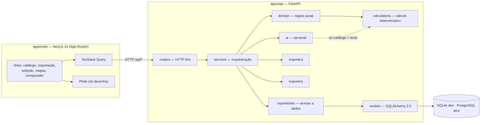
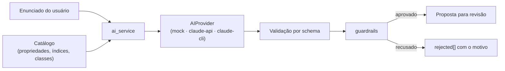
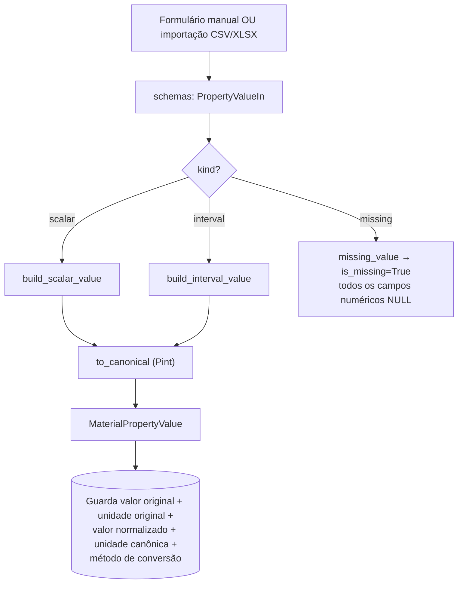
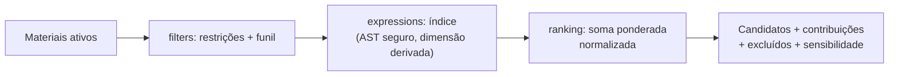
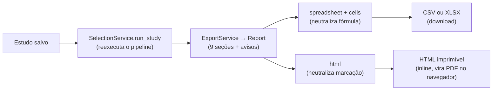
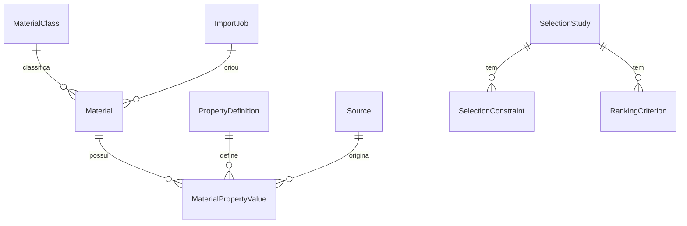

# Arquitetura

Documento canônico de arquitetura do MaterialSelect AI. Substitui e expande o
antigo `02-arquitetura.md`, que agora aponta para cá.

---

## 1. Visão geral

Monorepo com dois aplicativos desacoplados e um pacote de contrato de tipos.
O backend é a **fonte de verdade de todo número**; o frontend desenha.



### O princípio que organiza tudo

> **Todo número é calculado deterministicamente no backend, em unidade
> canônica, com a origem rastreável. O frontend não calcula. A IA não calcula.**

Isso não é estilo: é o que sustenta a alegação de reprodutibilidade do trabalho.
Duas consequências que costumam surpreender quem chega:

- **Geometria de gráfico é cálculo, não apresentação.** Inclinação de linha de
  índice, vértices de envelope e escores normalizados vêm prontos do servidor,
  em coordenadas de dados ([ADR 0004](adr/0004-geometria-de-graficos-no-backend.md)).
- **A IA propõe, nunca decide nem calcula** ([ADR 0003](adr/0003-ia-desacoplada-do-calculo.md)).

---

## 2. Estrutura de diretórios

```
MaterialSelect-AI/
├─ apps/
│  ├─ api/                      # backend FastAPI (~13.200 linhas Python)
│  │  ├─ alembic/versions/      # 5 migrations; fonte de verdade do schema
│  │  ├─ app/
│  │  │  ├─ ai/                 # camada de IA opcional (Fase 6)
│  │  │  ├─ calculations/       # cálculo determinístico
│  │  │  ├─ db/                 # engine, sessão, seed
│  │  │  ├─ domain/             # regras puras, sem I/O
│  │  │  ├─ exporters/          # relatório em CSV/XLSX/HTML (Fase 7)
│  │  │  ├─ importers/          # CSV/XLSX de entrada (Fase 3)
│  │  │  ├─ models/             # SQLAlchemy 2.0
│  │  │  ├─ repositories/       # acesso a dados, sempre parametrizado
│  │  │  ├─ routers/            # HTTP fino, sem regra de negócio
│  │  │  ├─ schemas/            # contratos Pydantic v2
│  │  │  ├─ services/           # orquestração de casos de uso
│  │  │  └─ tests/              # 389 testes
│  │  └─ pyproject.toml
│  └─ web/                      # frontend Next.js 14
│     ├─ app/                   # App Router: uma pasta por rota
│     ├─ components/            # componentes por domínio
│     ├─ lib/                   # api.ts, types.ts, i18n.ts, format.ts, charts.ts
│     └─ types/                 # declarações de módulos sem tipos
├─ packages/shared-types/       # contrato canônico (espelhado em web/lib/types.ts)
├─ docs/                        # esta documentação
├─ .github/workflows/ci.yml     # portão de CI
├─ sample-data/                 # CSV de exemplo para a importação
└─ scripts/                     # atalhos PowerShell
```

---

## 3. Camadas do backend e suas responsabilidades

O fluxo de uma requisição é **estritamente unidirecional**:

```
routers → services → repositories → models → banco
                  ↘ domain → calculations
```

| Camada | Responsabilidade | Não pode |
|---|---|---|
| `routers` | HTTP: validação de entrada, status. | Conter regra de negócio. |
| `services` | Orquestrar casos de uso; transformar entidades em schemas. | Emitir SQL cru. |
| `repositories` | Única camada que consulta o banco, sempre parametrizada. | Conter regra de negócio. |
| `domain` | Regras puras, sem I/O. | Importar SQLAlchemy ou FastAPI. |
| `calculations` | Cálculo determinístico. | Ter estado ou I/O. |
| `models` | Mapeamento objeto-relacional. | Conter lógica. |

### `calculations/` — o núcleo numérico

| Módulo | O que faz | Por que existe separado |
|---|---|---|
| `units.py` | Conversão via Pint; `to_canonical` (absoluto) e `to_canonical_delta` (diferença). | A distinção absoluto/diferença é obrigatória: ±5 °C é ±5 K, não ±278 K. |
| `expressions.py` | Parser **seguro sem `eval`**: AST com whitelist + interpretador manual. Roda em `float` e em `Quantity` do Pint. | A dimensão do índice é **derivada**, não declarada. |
| `powerlaw.py` | Reescreve o índice como monômio `C·Πp^e`; **deriva** a inclinação log-log `−a/b`. | É o que torna a linha de índice testável em vez de presumida. |
| `performance.py` | Avalia um índice para um material. | Compartilhado entre seleção e mapas — impede que discordem. |

### `domain/` — regras puras

| Módulo | Regra que guarda |
|---|---|
| `data_quality.py` | **Dado ausente nunca vira zero.** Todo construtor de valor passa aqui. |
| `filters.py` | Restrições e funil de eliminação. Propriedade ausente **elimina** o material. |
| `ranking.py` | Soma ponderada normalizada; `normalize_column` é público e reutilizado pelo comparador. |
| `geometry.py` | Fecho convexo (monotone chain) dos envelopes de classe. |
| `slug.py`, `errors.py` | Slugs e a hierarquia de erros mapeada para HTTP. |

### `ai/` — a camada opcional



O provedor recebe **só** o catálogo e o texto — nunca uma sessão de banco, nunca
o avaliador de expressões. Cinco regras em `guardrails.py`:

1. entidades sugeridas têm de existir no catálogo;
2. **todo número tem de aparecer no enunciado do usuário** — o que rejeita até
   conversões corretas (`300 °C` ancora `300 degC`, não `573.15 kelvin`);
3. unidades têm de ser dimensionalmente compatíveis;
4. **limiar dimensionado tem de declarar a unidade** (ausente vira canônica e,
   em escala com offset, inverte o sentido do enunciado);
5. prosa não pode introduzir números que o cálculo não produziu.

Três provedores atendem esse contrato: `mock` (padrão, determinístico, offline) e
dois que falam com o Claude — `claude-api` pela API da Anthropic e `claude-cli`
pelo Claude Code instalado na máquina. Os dois reais compartilham
`claude_base.py`, que os deixa estruturalmente incapazes de duas coisas: escrever
uma expressão de índice (o modelo devolve um slug; a expressão vem do catálogo)
e omitir as ressalvas de uma explicação (elas são do backend, em `caveats.py`).
Ver [D-35](DECISIONS.md).

### `exporters/` — saída auditável

`report.py` define o modelo do relatório — agnóstico de formato — e os **avisos
obrigatórios**. Dois renderizadores consomem o mesmo `Report`: `spreadsheet.py`
(CSV e XLSX) e `html.py` (documento imprimível, do qual sai o PDF pela impressão
do navegador).

Cada formato é protegido contra a injeção que lhe cabe, e as duas defesas são
distintas de propósito:

| Formato | Risco | Defesa |
|---|---|---|
| CSV/XLSX | célula executável (`=`, `+`, `-`, `@`, TAB, CR) | `cells.py`: escape **visível** (apóstrofo), não destrutivo. Número negativo sai como célula numérica de propósito. |
| HTML | marcação executável (`<script>`) | `html.py`: `html.escape` em todo valor, cabeçalho, título e nota — **mais** `Content-Security-Policy: default-src 'none'` no router, como camada independente. |

Aplicar o escape da planilha no HTML seria errado nas duas pontas: um `=` é
inerte em marcação, e o apóstrofo apareceria na tela como corrupção do dado.

---

## 4. Fluxo dos dados

### Entrada de um valor de propriedade



### Seleção determinística



### Exportação



---

## 5. Banco de dados

Alembic é a **fonte de verdade do schema**. `Base.metadata.create_all` só
aparece no seed e nos testes.



| Tabela | Papel |
|---|---|
| `material_class` | Taxonomia hierárquica (`parent_id`). |
| `material` | Identidade, `is_demo`, `is_active` (soft delete), `import_job_id`. |
| `property_definition` | Catálogo configurável: unidade canônica, dimensão, direção desejável. |
| `material_property_value` | O valor **com toda a proveniência**. |
| `source` | Rótulo de origem do dado. |
| `import_job`, `import_mapping_template` | Ciclo da importação e rollback lógico. |
| `performance_index` | Índices clássicos de Ashby com hipóteses. |
| `selection_study`, `selection_constraint`, `ranking_criterion` | Estudos reexecutáveis. |

**Campos de proveniência em `material_property_value`** — o coração do modelo:
`value_scalar`/`value_min`/`value_max`/`value_typical` (unidade **original**),
`original_unit`, `normalized_value` (unidade **canônica**), `canonical_unit`,
`conversion_method`, `uncertainty`, `measurement_condition`, `data_quality`,
`source_id`, `is_missing`.

> Atenção: `value_min`/`value_max`/`uncertainty` estão na unidade **original**.
> Quem for plotá-los num eixo canônico precisa converter — limites com
> `to_canonical`, incertezas com `to_canonical_delta`.

**Unicidade `(material_id, property_id)`** — uma linha por par, garantida pelo
banco (`uq_material_property_value_pair`). É garantia de determinismo, não
arrumação: com duas linhas para o mesmo par, o valor que chega a um gráfico, a
um filtro ou a um ranking passaria a depender da ordem em que o SELECT devolveu
as linhas, e o mesmo catálogo poderia responder duas coisas diferentes. Os
serviços já recusam propriedades repetidas dentro de um payload; só a constraint
cobre duas requisições concorrentes.

---

## 6. APIs

Todas sob `/api`. Erros de domínio são mapeados em `main.py`:
`NotFoundError`→404, `ValidationError`→400, `ConflictError`→409,
`IntegrityError`→409 com mensagem genérica.

| Área | Rotas |
|---|---|
| Saúde | `GET /health` |
| Catálogo | `GET/POST /materials`, `GET/PATCH/DELETE /materials/{id}`, `PUT /materials/{id}/values`, `GET /materials/chart` |
| Taxonomia | `GET/POST /classes`, `PUT/DELETE /classes/{id}` |
| Propriedades | `GET/POST /properties`, `PUT/DELETE /properties/{id}` |
| Importação | `POST /imports/upload`, `/{id}/preview`, `/{id}/validate`, `/{id}/commit`, `/{id}/cancel`, `/{id}/rollback`; `GET /imports`, `/{id}/report`; `GET/POST /import-templates` |
| Seleção | `POST /selection/filter`, `/index`, `/run`; `GET/POST /selection/studies`; `GET/DELETE /selection/studies/{id}`; `POST /selection/studies/{id}/run`; `GET/POST /performance-indices` |
| Visualização | `POST /charts/property-map`, `POST /charts/compare` |
| IA (opcional) | `GET /ai/status`, `POST /ai/interpret`, `POST /ai/explain` |
| Exportação | `GET /exports/catalogo.{csv,xlsx,html}`, `GET /exports/estudos/{id}.{csv,xlsx,html}` |

Visualização e comparação são **POST** porque a entrada é estruturada (par de
eixos, filtros, conjuntos de materiais, expressão e níveis) e não caberia
legivelmente numa query string.

---

## 7. Autenticação

**Não existe.** A API é aberta e não há usuários, sessões nem autorização. É uma
decisão consciente para o MVP de um trabalho acadêmico rodando localmente, e a
principal pendência antes de qualquer exposição em rede — ver
[TODO.md](TODO.md) e [DECISIONS.md](DECISIONS.md).

---

## 8. Bibliotecas importantes

### Backend
| Biblioteca | Papel | Observação |
|---|---|---|
| FastAPI + Pydantic v2 | HTTP e contratos | `allow_inf_nan=False` nos campos numéricos. |
| SQLAlchemy 2.0 | ORM | Estilo `Mapped[...]`/`mapped_column`. |
| Alembic | Migrations | Fonte de verdade do schema. |
| **Pint** | Unidades | [ADR 0002](adr/0002-pint-para-unidades.md). Um registry por processo. |
| openpyxl | XLSX (entrada e saída) | Leitura em `read_only` + `data_only`. |
| pytest, ruff, black | Qualidade | `line-length = 100`. |

### Frontend
| Biblioteca | Papel |
|---|---|
| Next.js 14 (App Router) | Rotas e build |
| TypeScript estrito | `strict` + `noUncheckedIndexedAccess` |
| TanStack Query | Estado de servidor |
| Plotly (`react-plotly.js`) | Só desenha |
| Tailwind | Estilo |
| Vitest | Testes de unidade |

---

## 9. Integrações

Nenhuma externa obrigatória. A camada de IA é opcional e, no provedor padrão
(`mock`), **não faz rede**. O sistema roda integralmente sem chave nenhuma.

---

## 10. Contrato de tipos

`packages/shared-types/index.ts` é canônico; `apps/web/lib/types.ts` o espelha
**manualmente**. Duplicação consciente para manter o build do Next simples no
MVP — está registrada como débito em [TODO.md](TODO.md). **Ao alterar um
contrato, altere os dois arquivos.**
