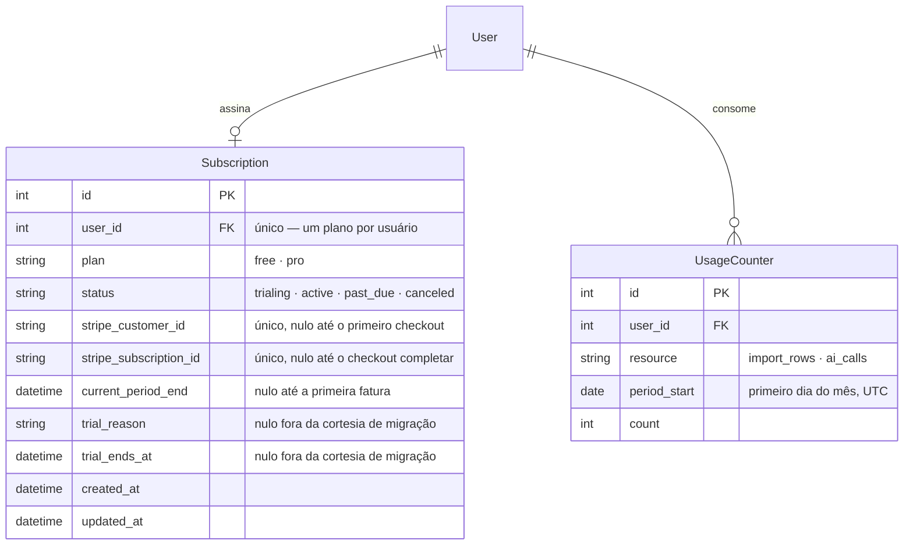

# Assinatura e limites de uso (Free/Pro) — design

Spec de arquitetura para o sub-projeto 3 da transformação em SaaS (ver
decomposição abaixo). Escopo: cobrança por usuário via Stripe, com um plano
free funcional e limites por recurso, mantendo o modelo de isolamento por
usuário já existente (D-42).

**Fora deste spec:** direção visual SaaS (sub-projeto 1), Table/Stepper
(sub-projeto 2), landing page de marketing, times/organizações. Cada um tem
seu próprio ciclo de design → plano → implementação.

> **Substitui a versão de 18/08/2026 deste mesmo arquivo** (commit `97f5bab`,
> mesclado na Fase 9 e nunca implementado — nenhum `Subscription`/billing
> chegou a existir no código). A versão anterior desenhava um gate binário:
> sem assinatura ativa, toda rota da ferramenta ficava bloqueada, sem plano
> free. Esta versão nasceu de uma conversa nova, mais detalhada, que fechou
> em Free + Pro com limites por recurso em vez de tudo-ou-nada — decisão
> tomada em conversa direta com o autor, não uma correção do spec anterior.
> Ficam preservadas do spec anterior: tenant = usuário individual, catálogo
> continua global (D-42), sem `tenant_id`/RLS, sem organização/equipe, Stripe
> mockado nos testes, páginas hospedadas do Stripe para checkout/portal.

---

## 1. Decisões de escopo já tomadas

Fechadas em conversa antes deste spec, não estão em aberto:

| Decisão | Resposta |
|---|---|
| O catálogo (materiais, classes, propriedades) vira por-tenant? | **Não.** Continua global e compartilhado, como hoje (D-42). |
| O que é um "tenant"? | **O usuário individual.** Sem conceito de organização/equipe. Cada conta Google é sua própria conta pagante. |
| `tenant_id` novo em cada tabela + RLS? | **Não.** `user_id`/`project_id` já são a fronteira de isolamento (D-42); uma coluna `tenant_id` paralela seria redundante e um risco de dessincronia sem ganho de isolamento real. |
| Existe plano free funcional, ou é assinar-ou-nada? | **Existe plano free**, com limites por recurso (seção 3). |
| Quantos planos pagos além do free? | **Um: Pro.** Sem Enterprise — sem organizações, um terceiro nível teria pouco a oferecer além de "mais limite". |
| UI de pagamento própria ou páginas hospedadas do Stripe? | **Páginas hospedadas** (Checkout + Customer Portal). Zero formulário de cartão no frontend; não conflita com D-23 porque a tela não é nossa. |
| O que acontece no limite? | **Bloqueio rígido** (402), sem tolerância/degradação. |
| Usuários existentes na migração? | **Pro por cortesia, 90 dias** (`BILLING_TRIAL_DAYS`), depois caem para free se não assinarem. Cadastro novo pós-deploy nasce free direto. |

## 2. Por que isso não é o desenho multi-tenant "de livro-texto"

O pedido original de "virar SaaS" presumia isolamento de dado por tenant. Com
"tenant = usuário individual" confirmado, a fronteira que já existe
(`Project`/`SelectionStudy` escopados por `user_id`, ver
[ARCHITECTURE.md §7](../../ARCHITECTURE.md) e [D-42](../../DECISIONS.md)) **é**
a fronteira de tenant — não precisa ser reconstruída. O trabalho real deste
spec é **cobrança e limite de uso**, não isolamento de dado.

---

## 3. Modelo de dados

Duas tabelas novas, sem alterar nenhuma existente:



`status` espelha parte do vocabulário de evento do Stripe de propósito —
traduzir tudo para um enum próprio custaria uma tabela de mapeamento sem
necessidade. `plan=PRO, status=TRIALING` cobre a cortesia de migração (sem
`stripe_subscription_id`); `plan=PRO, status=ACTIVE` cobre assinatura paga de
verdade. Só `PRO` com `status` em `(ACTIVE, TRIALING)` libera os tetos
maiores.

`UsageCounter` só existe para os dois recursos de **taxa mensal**
(`import_rows`, `ai_calls`, `UniqueConstraint(user_id, resource,
period_start)`). Os outros dois recursos limitados usam mecanismos mais
baratos, sem tabela própria:

- **`studies`** (capacidade): `COUNT(*)` direto em `SelectionStudy WHERE
  owner_id = user.id` — não é mensal, cai junto quando um estudo é apagado.
- **`report_exports`** (gate binário): checa só `plan == PRO and status in
  (ACTIVE, TRIALING)`, sem contar nada.

Migration via `alembic revision --autogenerate`, como todo o resto do schema
([CLAUDE.md §4](../../../CLAUDE.md)). Backfill: todo `User` existente recebe
`Subscription(plan=PRO, status=TRIALING, trial_reason="cortesia_usuario_existente",
trial_ends_at=hoje+90d)`.

## 4. `EntitlementService`

`app/services/entitlement_service.py`, mesmo nível que `AuditService` — recebe
`db` e o `User` atual, concentra toda a lógica de "este usuário pode fazer X?"
e "registre que X foi feito":

```python
class LimitExceededError(Exception):
    def __init__(self, resource: UsageResource, limit: int, plan: PlanTier): ...

class EntitlementService:
    def __init__(self, db: Session, user: User): ...
    def check_and_record(self, resource: UsageResource, amount: int = 1) -> None:
        """import_rows / ai_calls. Levanta LimitExceededError se o uso
        ultrapassaria o teto do plano; só grava o incremento se couber."""
    def check_capacity(self, resource: UsageResource) -> None:
        """studies: conta linhas existentes, sem incrementar contador."""
    def can_export_reports(self) -> bool:
        """report_exports: gate binário, sem UsageCounter."""
```

Tetos do plano ficam num dict constante em `entitlement_service.py`, não no
banco (evita uma tabela de configuração para dois planos):

```python
PLAN_LIMITS: dict[PlanTier, dict[UsageResource, int | None]] = {
    PlanTier.FREE: {
        UsageResource.IMPORT_ROWS: 500,
        UsageResource.AI_CALLS: 20,
        UsageResource.STUDIES: 3,
    },
    PlanTier.PRO: {
        UsageResource.IMPORT_ROWS: None,   # None = ilimitado
        UsageResource.AI_CALLS: None,
        UsageResource.STUDIES: None,
    },
}
```

Os números acima são ponto de partida, ajustáveis sem migração (são
constante, não coluna). `ImportService.validate()`/`.commit()`
(`amount=linhas_da_planilha`), `AIService.explain()`/sugestões (`amount=1`), o
serviço que cria `SelectionStudy`, e os routers de export chamam o método
correspondente antes de agir — cada um propaga `LimitExceededError` até o
router.

## 5. Rotas novas

Todas sob `/api/billing`:

| Rota | Autenticação | Papel |
|---|---|---|
| `POST /api/billing/checkout-session` | `get_current_user` só | Cria uma Stripe Checkout Session (mode=subscription, price=`STRIPE_PRICE_ID_PRO`), cria o Customer no Stripe na primeira vez, devolve `{"url": "..."}`. |
| `POST /api/billing/portal-session` | `get_current_user` + `stripe_customer_id` já existente | Cria uma Customer Portal Session, devolve `{"url": "..."}`. |
| `POST /api/billing/webhook` | **Pública** — verificada pela assinatura HMAC do cabeçalho `Stripe-Signature`, nunca por cookie | Recebe eventos do Stripe e sincroniza `Subscription` (seção 6). |
| `GET /api/me/subscription` | `get_current_user` só | Plano atual + uso do mês por recurso; o frontend usa para a página `/assinatura` e o indicador da sidebar. |

`LimitExceededError` é capturada num exception handler global em
`app/main.py` (mesmo padrão dos outros erros de domínio) e vira HTTP 402:

```json
{
  "detail": "Limite do plano free atingido: 20 chamadas de IA neste mês.",
  "resource": "ai_calls",
  "plan": "free",
  "limit": 20
}
```

O campo `resource` deixa o frontend decidir a UI certa sem parsear a
mensagem.

## 6. Webhook do Stripe

`app/services/billing_service.py` encapsula o SDK do Stripe — nenhum outro
módulo importa `stripe` diretamente, mesmo isolamento que `app/calculations/units.py`
já dá ao Pint. Eventos tratados:

| Evento | Efeito |
|---|---|
| `checkout.session.completed` | `plan=PRO, status=ACTIVE`, grava `stripe_subscription_id` |
| `customer.subscription.updated` | Sincroniza `status`/`current_period_end` |
| `customer.subscription.deleted` | `plan=FREE, status=CANCELED` |
| `invoice.payment_failed` | `status=PAST_DUE` — mantém `PRO` até o Stripe cancelar de fato; não derruba no primeiro cartão recusado |

Assinatura inválida → 400, sem tocar o banco. Evento de tipo não tratado →
200 sem processar (Stripe espera 2xx para não reenviar — comportamento
recomendado por eles, não omissão nossa). Falha ao persistir durante o
webhook → 500; o Stripe reentrega automaticamente, sem fila própria
necessária.

## 7. Frontend

- Rota nova `apps/web/app/assinatura/page.tsx` (padrão de rota em português já
  usado por `/painel`, `/mapas`, `/estilo`): plano atual, uso do mês por
  recurso (barra de progresso com os primitivos de `components/ui/`, cor só
  via token D-28), data de fim do trial quando aplicável, botão que chama
  `checkout-session`/`portal-session` e redireciona `window.location.href`
  para a URL do Stripe.
- **Indicador na sidebar** (`components/layout/AppSidebar.tsx`): bloco
  compacto abaixo dos itens de navegação, só quando `plan === "free"` — nome
  do plano + a métrica mais próxima do teto entre os quatro recursos (ex.:
  "IA: 14/20 este mês") + link para `/assinatura`. Some inteiramente para
  usuários Pro (ativo ou trial). Segue a regra de recolhimento da sidebar
  (D-37): ao recolher para 76px, o texto vira `sr-only`, nunca é removido; a
  barra permanece como indicador mínimo. Dado vem de `useSubscription()`
  (`apps/web/lib/hooks/`), buscado uma vez por sessão de navegação e
  revalidado ao focar a aba.
- Tratamento de erro (D-24) nos quatro fluxos gateados ganha um caso a mais
  para HTTP 402: mensagem explicando o limite + link para `/assinatura`, em
  vez do erro genérico — import (`apps/web/app/importar/`), botão de
  explicação de IA, criar `SelectionStudy`, export de laudo/relatório.
- Nenhuma tela nova de cartão — Stripe Checkout/Portal cobre isso (D-23
  intacto). `apps/web/lib/types.ts` e `packages/shared-types/index.ts` ganham
  `SubscriptionOut`/`UsageOut` (duplicação consciente já documentada no
  TODO).

## 8. Variáveis de ambiente

Seguindo o padrão já usado pela camada de IA (`.env.example` como fonte,
nenhum valor secreto com default):

| Variável | Padrão | Efeito |
|---|---|---|
| `STRIPE_API_KEY` | vazio, sem padrão | Sem ela, `/api/billing/*` responde 503 — mesmo padrão do Google OAuth quando `GOOGLE_CLIENT_ID` falta. |
| `STRIPE_WEBHOOK_SECRET` | vazio | Verifica a assinatura HMAC do webhook; sem ele, o endpoint recusa todo evento. |
| `STRIPE_PRICE_ID_PRO` | vazio | ID do preço recorrente do plano Pro no Stripe. |
| `BILLING_TRIAL_DAYS` | `90` | Duração da cortesia de migração (seção 3). |

Dev local: Stripe CLI (`stripe listen --forward-to localhost:8000/api/billing/webhook`),
sem infra nova.

## 9. Testes

Stripe é **mockado**, nunca chamado de verdade em CI — mesmo espírito do
provedor `mock` de IA. `BillingService` recebe o cliente Stripe injetado; os
testes usam um stub que grava as chamadas, sem rede.

- `test_entitlement_service.py`: cada `UsageResource` — taxa mensal (nega no
  teto, aceita um a menos, reseta em novo `period_start`), capacidade
  (`STUDIES`), gate binário (`REPORT_EXPORTS`). Concorrência fora de escopo —
  SQLite em memória não simula corrida de fato, e não é o padrão de teste do
  projeto em nenhum outro lugar.
- `test_billing_webhook.py`: os quatro eventos da seção 6 contra um
  `Subscription` fixture, incluindo `invoice.payment_failed` não derrubar o
  plano na hora. Assinatura inválida → 400 sem tocar o banco.
- `test_billing_service.py`: `checkout-session`/`portal-session` chamam o SDK
  com os parâmetros certos, sem rede.
- Testes existentes que criam `SelectionStudy`/rodam `ImportService`/`AIService`
  em quantidade (ex.: `test_case_study.py`) precisam de uma `Subscription` PRO
  na fixture do usuário de teste, senão esbarram no teto free — mesmo ajuste
  que M1 exigiu para `source_license_label`.
- `test_isolation.py` continua o canário; as tabelas novas não mudam o
  tratamento de BEGIN.

Frontend (Vitest): `useSubscription()` e o mapeamento de 402 para
banner/toast nos quatro fluxos gateados — sem teste de UI do Checkout/Portal
em si (é o Stripe, fora do domínio testável).

**Fora do E2E (Playwright), de propósito:** webhook e checkout dependem de
rede externa que a suíte hoje evita (`E2E_SESSION_TOKEN`, sem cliente OAuth
real — mesma lógica de A5). Limitação conhecida, não uma lacuna a fechar
neste spec.

## 10. O que fica de fora, de propósito

- **Sem RLS no Postgres.** Com tenant = usuário e filtro por `user_id`/
  `project_id` já aplicado em toda repository, RLS seria defesa em
  profundidade, não a defesa em si — e o projeto ainda roda em SQLite no dia
  a dia. Item futuro, não agora.
- **Sem conceito de organização/equipe.** Confirmado fora de escopo (seção 1).
  Se um dia for necessário, o caminho é uma tabela `Organization` entre
  `User` e `Project` — não descrito aqui.
- **Sem Enterprise/terceiro plano.** Confirmado fora de escopo (seção 1).
- **Sem tolerância/degradação no limite.** Bloqueio é sempre rígido (seção 1).
- **Sem reconciliação periódica com o Stripe.** O webhook é a fonte de
  verdade; o retry nativo do Stripe em falha de persistência (seção 6) cobre
  o caso de erro transitório sem precisar de um job de sincronização à
  parte.

---

## 11. Auto-revisão do spec

- Nenhum "TBD" ou seção incompleta restando.
- Consistente com D-42 (não o contradiz — estende) e com o motivo de
  substituição declarado no topo do arquivo.
- Escopo focado: schema + limites + cobrança + gate de acesso. Redesign
  visual e landing page ficam para os specs deles.
- Ambiguidade checada: "tenant" está definido explicitamente (usuário
  individual); os quatro recursos limitados têm mecanismo explícito cada
  (taxa mensal vs. capacidade vs. gate binário); o que acontece no limite
  está definido (bloqueio rígido, HTTP 402).
