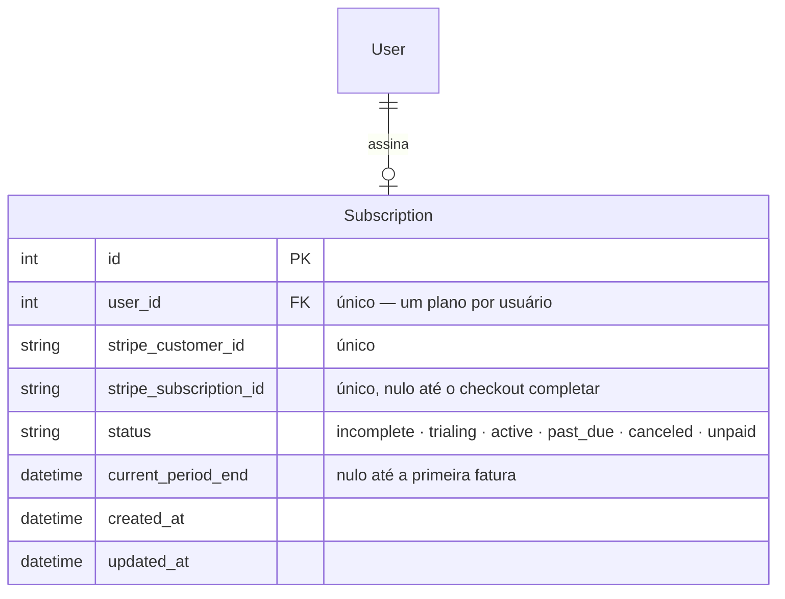
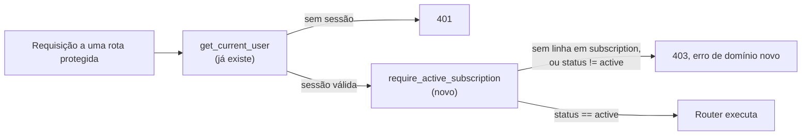

# Multi-tenant e cobrança (Stripe) — design

Spec de arquitetura para o sub-projeto 3 da transformação em SaaS (ver decomposição
abaixo). Escopo: fazer o acesso à ferramenta depender de uma assinatura Stripe
ativa, mantendo o modelo de isolamento por usuário já existente (D-42).

**Fora deste spec:** direção visual SaaS (sub-projeto 1), Table/Stepper
(sub-projeto 2), landing page de marketing. Cada um tem seu próprio ciclo de
design → plano → implementação.

---

## 1. Decisões de escopo já tomadas

Estas foram fechadas em conversa antes deste spec e não estão em aberto:

| Decisão | Resposta |
|---|---|
| O catálogo (materiais, classes, propriedades) vira por-tenant? | **Não.** Continua global e compartilhado, como hoje (D-42). |
| O que é um "tenant"? | **O usuário individual.** Sem conceito de organização/equipe. Cada conta Google é sua própria conta pagante. |
| `tenant_id` novo em cada tabela + RLS, como o pedido original de "SaaS" descrevia? | **Não.** `user_id`/`project_id` já são a fronteira de isolamento (D-42); uma coluna `tenant_id` paralela seria redundante e um risco de dessincronia sem ganho de isolamento real. |
| O que fica bloqueado sem assinatura ativa? | **Tudo.** Sem plano ativo, só a landing page (marketing, fora deste spec) e as rotas de autenticação funcionam — nenhuma rota da ferramenta (catálogo, seleção, mapas, etc.). |

## 2. Por que isso não é o desenho multi-tenant "de livro-texto"

O pedido original presumia um SaaS do zero, com `tenant_id` em toda tabela e
RLS no banco. Este projeto já tem uma fronteira de isolamento correta e testada
(`Project`/`SelectionStudy` escopados por `user_id`, ver
[ARCHITECTURE.md §7](../../ARCHITECTURE.md) e [D-42](../../DECISIONS.md)). Com
"tenant = usuário individual" confirmado, essa fronteira já **é** a fronteira
de tenant — não precisa ser reconstruída, só precisa ganhar uma verificação de
plano ativo por cima. O trabalho real deste spec é **cobrança**, não
isolamento de dado.

---

## 3. Modelo de dados

Uma tabela nova, sem alterar nenhuma existente:

`status` espelha o vocabulário de evento do Stripe de propósito — traduzir para
um enum próprio custaria uma tabela de mapeamento sem necessidade. `active` é o
único valor que libera acesso; todos os outros bloqueiam.

Migration via `alembic revision --autogenerate`, como todo o resto do schema
(seção 4 do `CLAUDE.md`).

## 4. Middleware de acesso

Extensão simétrica de `app/dependencies.py`, ao lado de `get_current_user`:

Aplicada a todo router que hoje já depende de `get_current_user` — ou seja,
todos exceto os já públicos hoje (`/health`, `/auth/google/login`,
`/auth/google/callback`, `/auth/logout`) e os novos públicos da seção 5.

Novo tipo de erro de domínio (`SubscriptionRequiredError` ou similar), mapeado
em `main.py` junto dos existentes (`NotFoundError`→404,
`ValidationError`→400, ...), retornando 403 com uma mensagem que o frontend
usa para decidir o redirecionamento (seção 6).

## 5. Rotas novas

Todas sob `/billing`:

| Rota | Autenticação exigida | Papel |
|---|---|---|
| `POST /billing/checkout` | `get_current_user` **só** — não pode exigir assinatura para poder comprar uma | Cria uma Stripe Checkout Session para o usuário, devolve a URL de redirecionamento. |
| `POST /billing/portal` | `get_current_user` + assinatura existente (precisa de `stripe_customer_id`) | Cria uma sessão do Billing Portal do Stripe. |
| `POST /billing/webhook` | **Pública** — verificada pela assinatura HMAC do cabeçalho `Stripe-Signature`, nunca por cookie | Recebe eventos do Stripe e sincroniza `subscription`. |
| `GET /billing/status` | `get_current_user` **só** | O frontend usa para saber se deve mostrar a tela de "assine para continuar" — não pode depender de já ter assinatura, ou vira circular. |

## 6. Serviços e frontend

- `BillingService` (orquestração) + `SubscriptionRepository` (acesso a dado,
  parametrizado), seguindo a mesma separação de camadas do resto do backend
  ([CLAUDE.md §4](../../../CLAUDE.md)). Chamada ao SDK do Stripe fica isolada
  no service — nunca no router, nunca na repository.
- Rota nova no frontend, `/assinatura`, com CTA de assinar (chama
  `/billing/checkout` e redireciona para a URL do Stripe) e de gerenciar
  (chama `/billing/portal`).
- Gate no frontend: usuário autenticado sem assinatura ativa é redirecionado
  para `/assinatura` — mesmo padrão que `/entrar` já aplica a quem não está
  logado.

## 7. Variáveis de ambiente

Seguindo o padrão já usado pela camada de IA (`.env.example` como fonte,
nenhum valor secreto com default):

| Variável | Padrão | Efeito |
|---|---|---|
| `STRIPE_API_KEY` | vazio | Sem ela, `/billing/*` responde 503 — mesmo padrão do Google OAuth quando `GOOGLE_CLIENT_ID` falta. |
| `STRIPE_WEBHOOK_SECRET` | vazio | Usado para verificar a assinatura HMAC do webhook; sem ele, o endpoint recusa todo evento. |
| `STRIPE_PRICE_ID` | vazio | O preço/plano que o checkout usa. Um só plano no v1 — sem seletor de plano na interface. |

## 8. Testes

Stripe é **mockado**, nunca chamado de verdade em CI — mesmo espírito do
provedor `mock` de IA, que já é o padrão determinístico do projeto. Um cliente
Stripe falso substitui o SDK nos testes de `BillingService`. O webhook é
testado com payloads de evento gravados como fixture (`checkout.session.completed`,
`customer.subscription.updated`, `customer.subscription.deleted`,
`invoice.payment_failed`), cobrindo a transição de `status` para cada um.

Segue a convenção de "todo cálculo precisa de teste" ([CLAUDE.md §5](../../../CLAUDE.md))
— isto não é cálculo numérico, mas a mesma disciplina de teste antes de correção
se aplica: cada transição de `status` tem teste próprio.

## 9. O que fica de fora, de propósito

- **Sem RLS no Postgres.** Com tenant = usuário e filtro por `user_id`/`project_id`
  já aplicado em toda repository (padrão existente), RLS seria defesa em
  profundidade, não a defesa em si. Fica como item futuro, não agora — e o
  projeto ainda roda em SQLite no dia a dia; RLS é recurso só de Postgres.
- **Sem conceito de organização/equipe.** Confirmado fora de escopo (seção 1).
  Se um dia for necessário, o caminho é uma tabela `Organization` entre `User`
  e `Project` — não descrito aqui.
- **Sem seletor de plano/preço na interface.** Um único `STRIPE_PRICE_ID` no v1.

---

## 10. Auto-revisão do spec

- Nenhum "TBD" ou seção incompleta restando.
- Consistente com D-42 (não o contradiz — estende).
- Escopo focado: só schema + cobrança + gate de acesso. Redesign visual e
  landing page ficam para os specs deles.
- Ambiguidade checada: "tenant" está definido explicitamente (usuário
  individual); "bloqueado sem assinatura" está definido explicitamente (tudo,
  exceto auth e landing).
